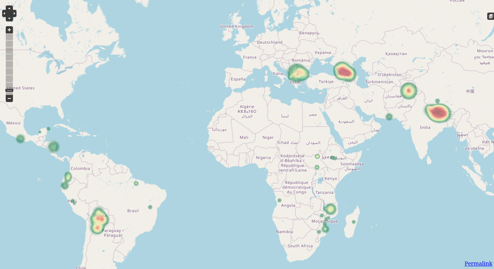
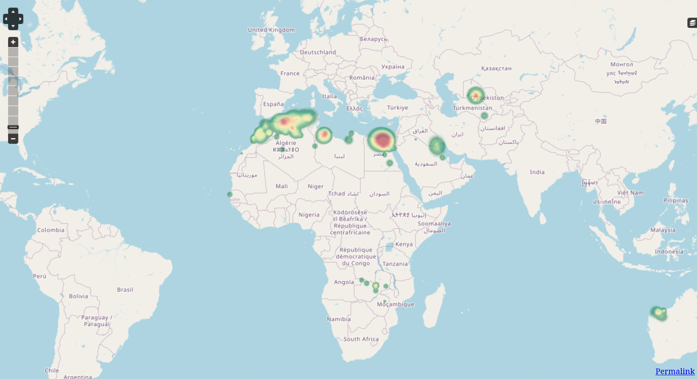
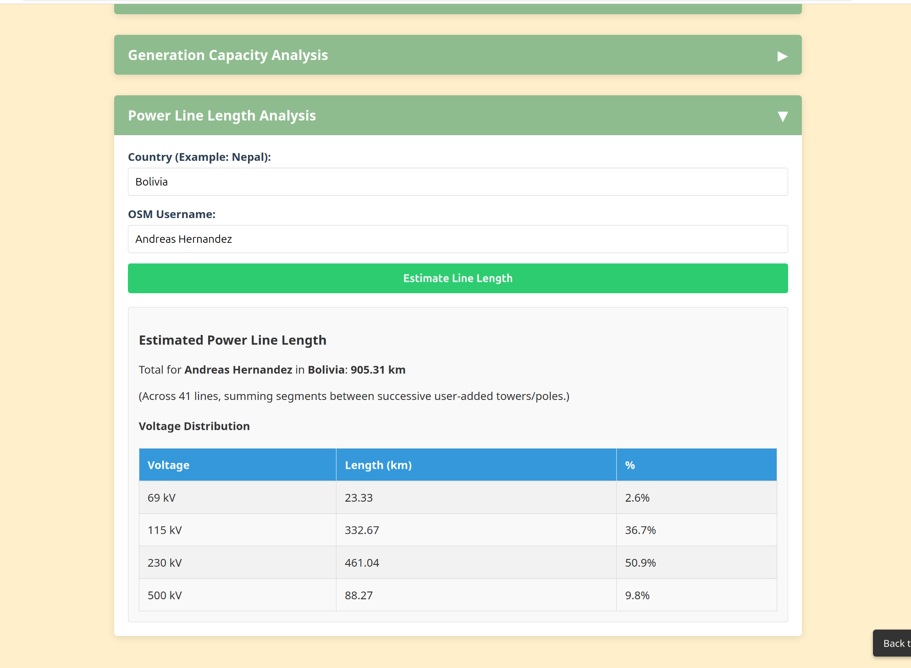

<h1>Our Progress and Country Logbook</h1>

Welcome to our team's progress page, where you can see our mapping progress in many different countries.

:question: If you want more detailed information about each country, visit the OSM wiki page about [power networks](https://wiki.openstreetmap.org/wiki/Power_networks).

If you want to join our community, join our OSM [team](https://mapping.team/teams/1570/invitations/eec8b5f8-b212-4013-8707-96245f300fa1), and use our hashtag **#ohmygrid**!
 

Here are some [heatmaps](https://yosmhm.neis-one.org/) of the mapping work some of our team has done (more than 100k towers placed!):

  
  
  

<!-- LOGBOOK: Add your country below the last country. Some css (in extra.css at "Hide ### from logbook") is being used to remove the ### from the table of contents so please use the same name or tell me -->

<!-- You can find country flag emojis or codes here https://www.webnots.com/copy-paste-country-flag-emoji-symbols/-->

## [**Nepal**](https://wiki.openstreetmap.org/wiki/Power_networks/Nepal) 🇳🇵 
??? success "Mapping progress"
    **Progress timeline**
    
    === "Before (April 2025)"
        {: .img-border }
        *April 8th, 2025*
        
    === "After (May 2025)"
        {: .img-border }
        *May 2, 2025*

    ### Success stories 
    - Added Nepal's largest power plant (456 MW)
    - Mapped 132kv Nepal-India interconnector
    - Finalised 400kv lines
    - Connected Pokhara-Butwal substations

    ### Key numbers 
    - **+3137** power towers added (10k total)
    - **+1120km** power lines (44% increase, as prior to our mapping, the transmission grid was 2560km)
    - **+980 MW** added capacity (1260 MW total)

<!-- End of country logbook -->
 
<!-- Progress Bars Section -->
## **
Community mapping progress :rocket:
**

 
   <button id="refresh-btn" style="margin-bottom:1rem;">
     🔄 Refresh stats (only click if the bars are not "loading...")
   </button>

  

    <label>Contributors for <code>#ohmygrid</code>:</label>
    
 

 

    Loading…
  

  

    <label>Total Edits for <code>#ohmygrid</code>:</label>
    

      

 

    Loading…
  

  

    <label>Towers mapped by our team:</label>
    

      

    

    Loading…
     
    Last updated: —
  

You can find more stats for #ohmygrid at [OhsomeNowstats](https://stats.now.ohsome.org/dashboard#hashtag=ohmygrid&start=2025-03-12T22:00:00Z&end=2025-05-14T21:59:59Z&interval=P1M&countries=&topics=).

##**Want to track and see your personal mapping progress (KPI)? :white_check_mark:**  
This [repository](https://github.com/open-energy-transition/KPI-OSM/tree/main) has a few different scripts (Overpass and Python) to measure your KPI's, as well as a [web-interface](https://open-energy-transition.github.io/KPI-OSM/). You can see how many towers you have placed and the respective line voltage, the power line length you have edited in km, the amount of MW capacity you added as a % of the country's mapped capacity, and a distribution table by voltage of substations you have added.  

  
  

