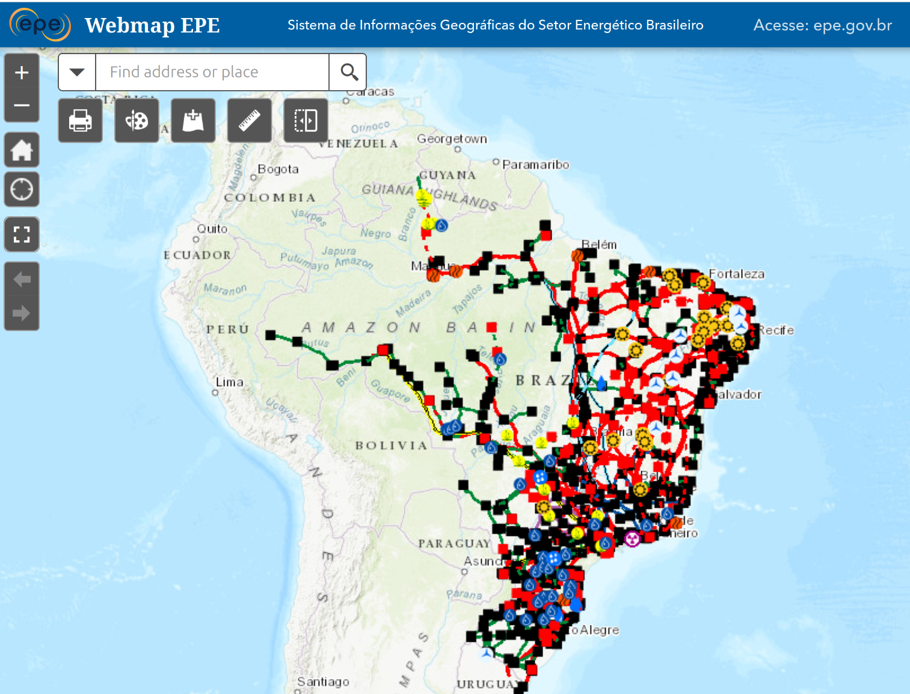
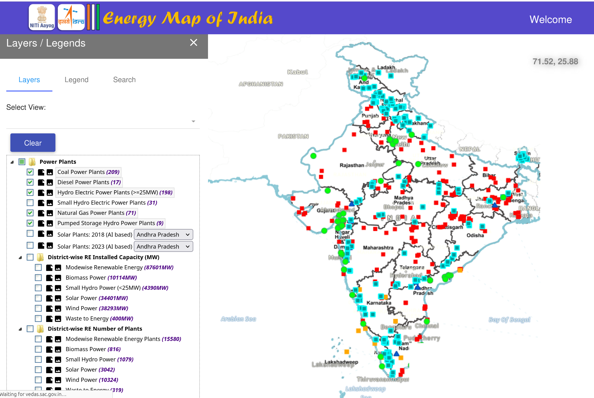
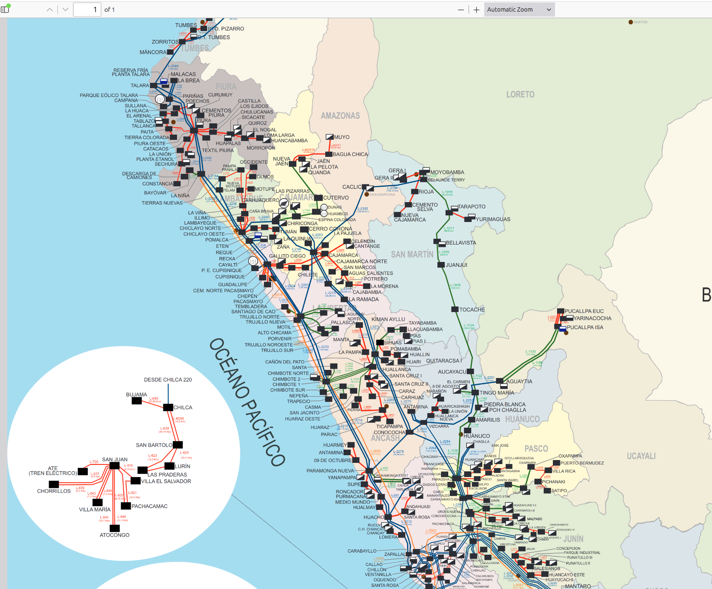

# **Awesome list**

**A curated list of resources in the field of electric grid mapping to improve global open data coverage, harmonization and quality for a sustainable energy transition.** 

This list includes national datasets and maps, information on electrical grid mapping in OSM, grid design basics, and other publications. Find the full list in this [repository](https://github.com/open-energy-transition/Awesome-Electric-Grid-Mapping/tree/main).

  
  
  

