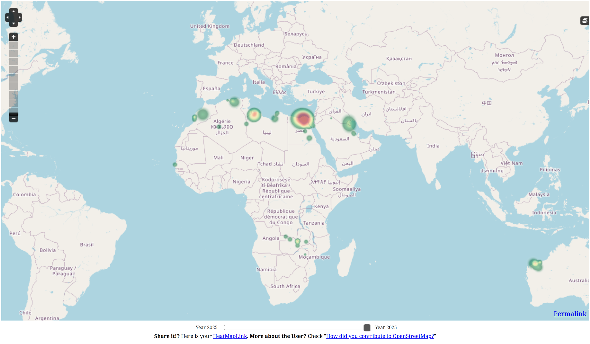
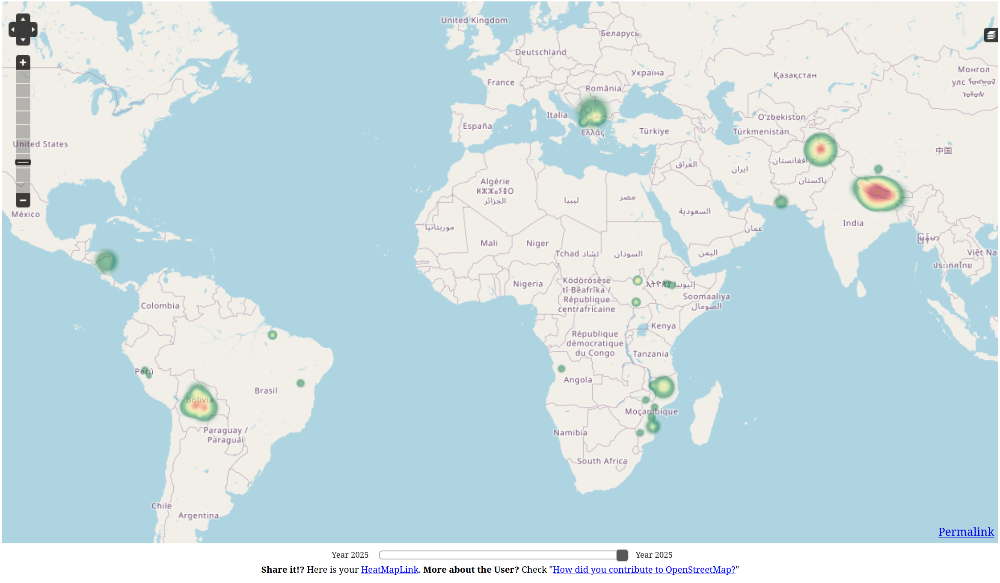
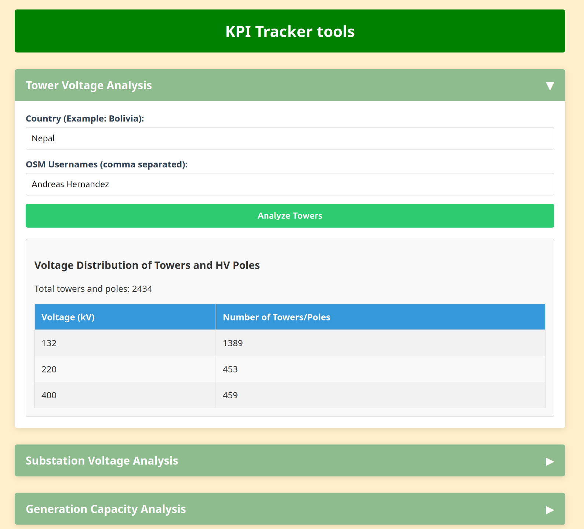
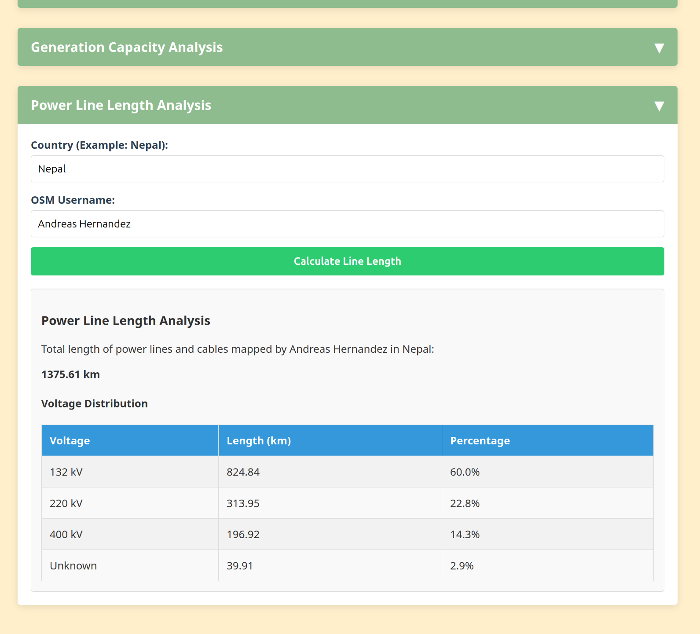

# **Contribute and map with us!**

Our initiative wants to build a community of mappers from all around the world, so that power infrastructure is continuously added and improved in the future.
You can join this [discord](https://discord.gg/a5znpdFWfD) server to learn more, and chat about OSM grid mapping with us.
 

Here are some [heatmaps](https://yosmhm.neis-one.org/) of the mapping work some of our team has done:

  
  

##**Want to track and see your personal mapping progress (KPI)? :white_check_mark:**  
This [repository](https://github.com/open-energy-transition/KPI-OSM/tree/main) has a few different scripts (Overpass and Python) to measure your KPI's, as well as a [web-interface](https://open-energy-transition.github.io/KPI-OSM/). You can see how many towers you have placed and the respective line voltage, the power line length you have edited in km, the amount of MW capacity you added as a % of the country's mapped capacity, and a distribution table by voltage of substations you have added.  

  
  

