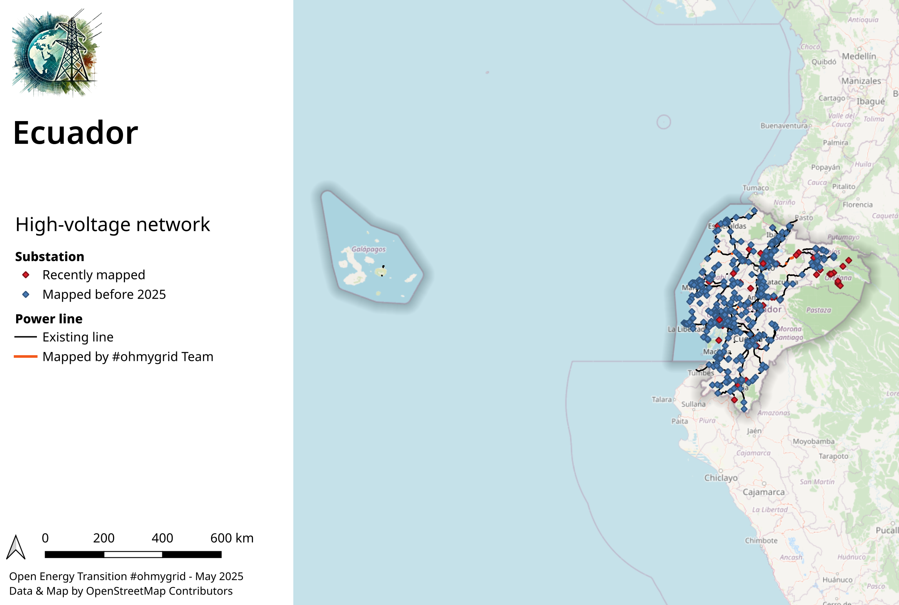

# Ecuador (EC)

<table width="90%">
<tr>
<td>

  
</td>
<td>
<h3>Country characteristics</h3>

Continent: Population: Area: GDP (USD billions):

South America 16,938,986 257,204 km2 115.0 B$

<h3>Electrical network mapped on OpenStreetMap</h3>

Generation capacity: 
Number of power plants: 
Number of substations: 
Power line length: 
International connections: 

5644 MW 
85 
620 
8379 km 
4 

  <h4>See also :
<a href="https://wiki.openstreetmap.org/wiki/Power_networks/Ecuador" target="_blank">OSM wiki page</a> -
<a href="https://openstreetmap.org/relation/108089" target="_blank">OSM country shape</a>
</h4>

 <i>data from Wikidata and OpenInfraMap</i>
</td>
</tr>
</table>

## Progress map

{width=90%}

## Grid connectivity overview

Grid connectivity summary (nb of substations x nb of connections) : 79x91 + 44x57 + 12x11 + 6x6 + 6x6 + 5x4 + 5x4 + 4x3 + 3x2 + 3x2 + 3x2 + 3x2 + 3x2 + 2x2 + 2x1 + 2x1 + 2x1 + 2x1 + 2x1 + 2x1 + 2x1 + 2x1 + 2x1 + 2x1 + 2x1 + 2x1 + 2x1 + 2x1 + 2x1 + 2x1 + 2x1 + 2x1

{width=90%}

