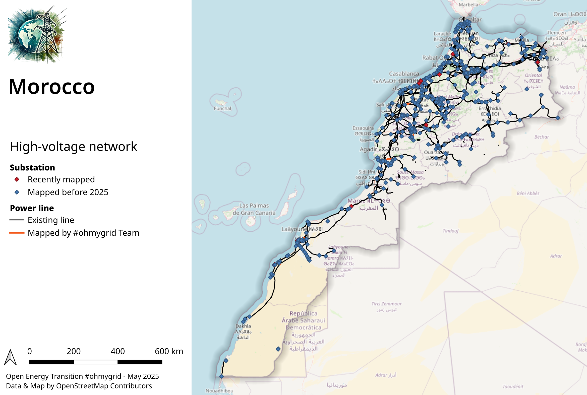

# Morocco (MA)

<table width="90%">
<tr>
<td>

  
</td>
<td>
<h3>Country characteristics</h3>

Continent: Population: Area: GDP (USD billions):

Africa 36,828,330 446,550 km2 134.2 B$

<h3>Electrical network mapped on OpenStreetMap</h3>

Generation capacity: 
Number of power plants: 
Number of substations: 
Power line length: 
International connections: 

11060 MW 
106 
592 
37086 km 
4 

  <h4>See also :
<a href="https://wiki.openstreetmap.org/wiki/Power_networks/Morocco" target="_blank">OSM wiki page</a> -
<a href="https://openstreetmap.org/relation/3630439" target="_blank">OSM country shape</a>
</h4>

 <i>data from Wikidata and OpenInfraMap</i>
</td>
</tr>
</table>

## Progress map

{width=90%}

## Grid connectivity overview

Grid connectivity summary (nb of substations x nb of connections) : 367x823 + 5x11 + 4x3 + 3x2 + 3x2 + 2x2 + 2x1 + 2x1 + 2x1 + 2x1 + 2x1 + 2x1 + 2x1 + 1x3 + 1x2

{width=90%}

