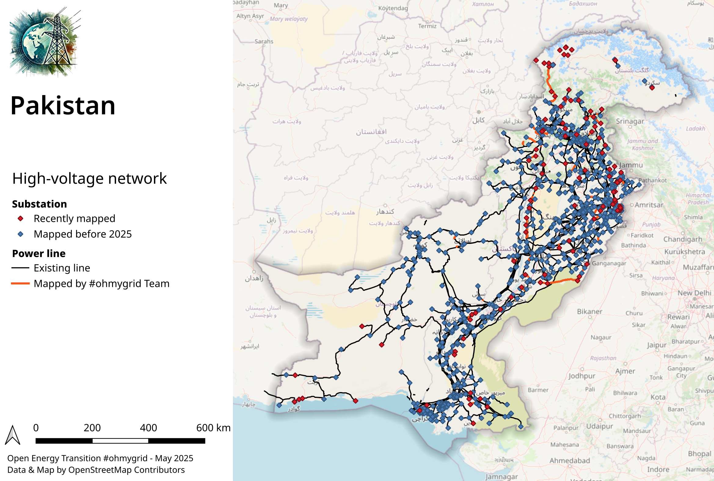

# Pakistan (PK)

<table width="90%">
<tr>
<td>

  
</td>
<td>
<h3>Country characteristics</h3>

Continent: Population: Area: GDP (USD billions):

Asia 223,773,700 881,913 km2 376.5 B$

<h3>Electrical network mapped on OpenStreetMap</h3>

Generation capacity: 
Number of power plants: 
Number of substations: 
Power line length: 
International connections: 

48260 MW 
241 
973 
41189 km 
2 

  <h4>See also :
<a href="https://wiki.openstreetmap.org/wiki/Power_networks/Pakistan" target="_blank">OSM wiki page</a> -
<a href="https://openstreetmap.org/relation/307573" target="_blank">OSM country shape</a>
</h4>

 <i>data from Wikidata and OpenInfraMap</i>
</td>
</tr>
</table>

## Progress map

{width=90%}

## Grid connectivity overview

Grid connectivity summary (nb of substations x nb of connections) : 660x1136 + 9x12 + 5x5 + 5x5 + 3x4 + 3x2 + 3x2 + 3x2 + 2x3 + 2x2 + 2x2 + 2x1 + 2x1 + 2x1 + 2x1 + 2x1 + 2x1 + 2x1 + 2x1 + 2x1 + 2x1 + 2x1 + 2x1 + 2x1 + 1x3 + 1x1 + 1x1

{width=90%}

