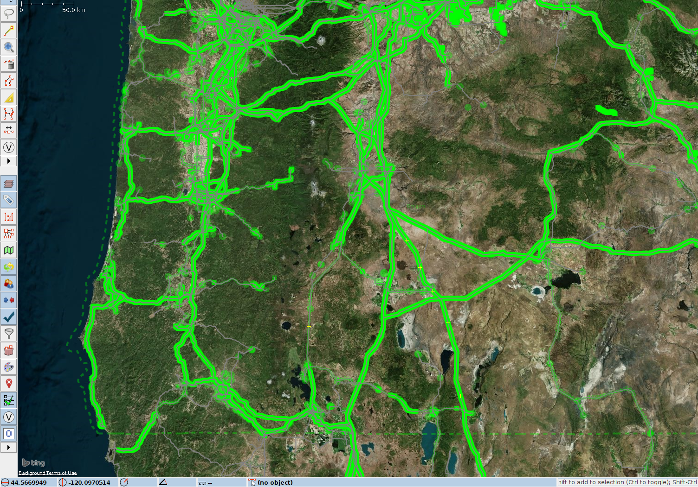
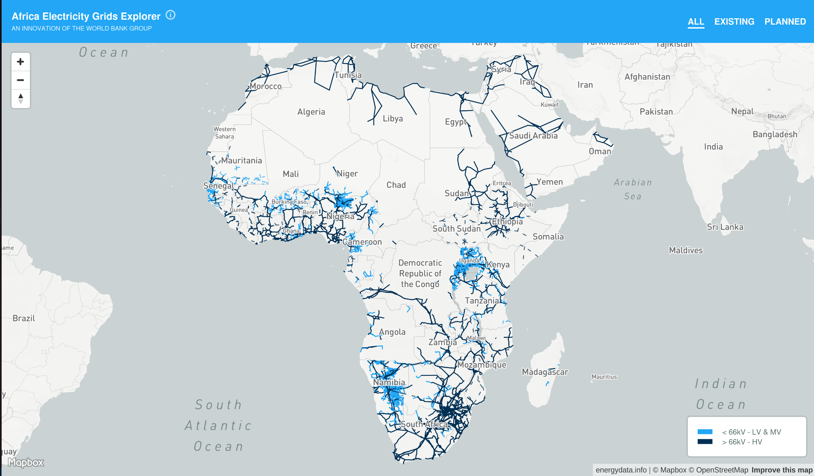
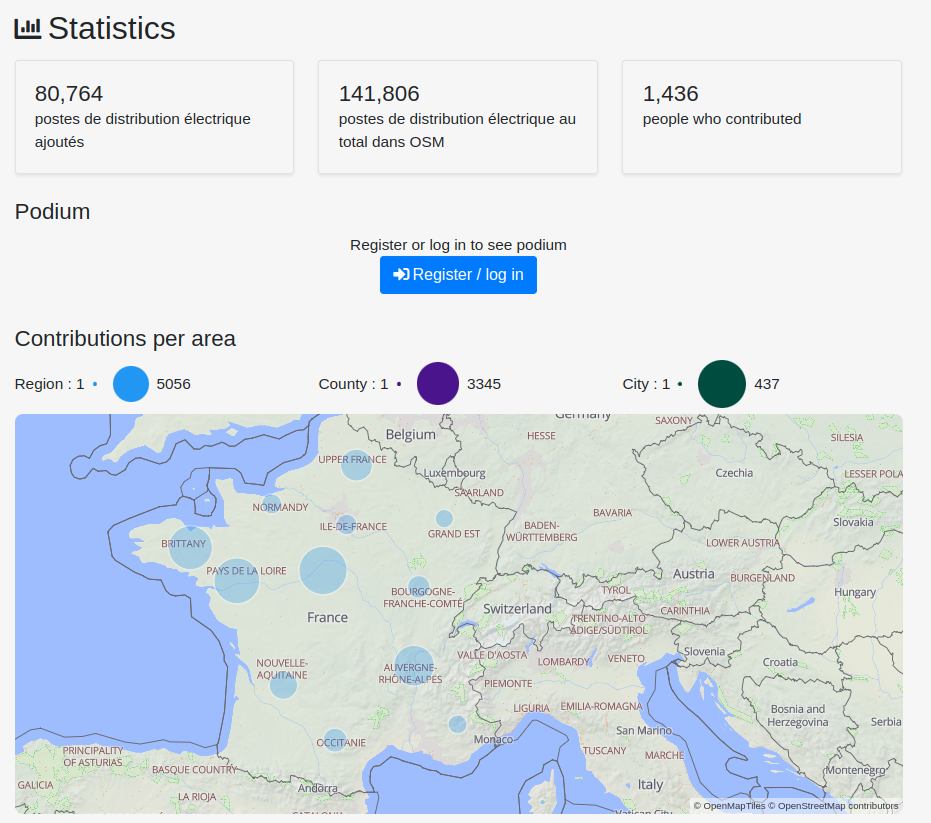
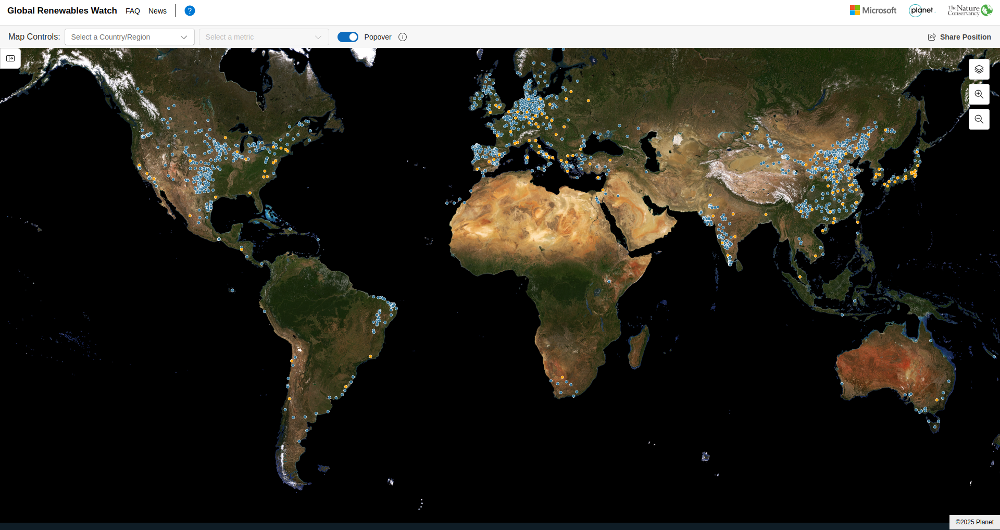
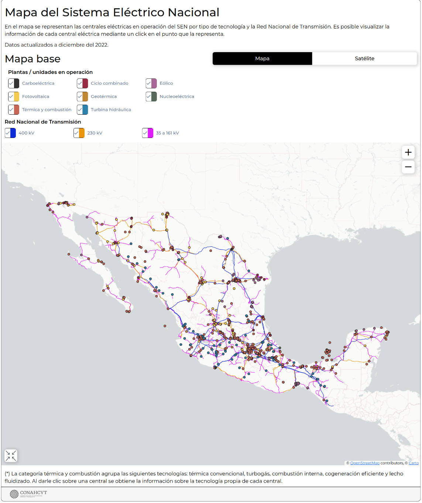
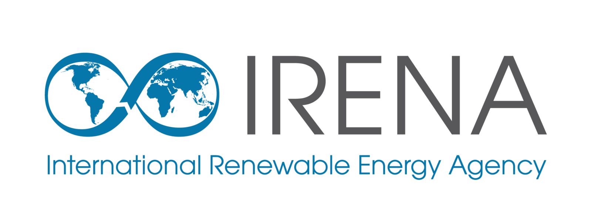
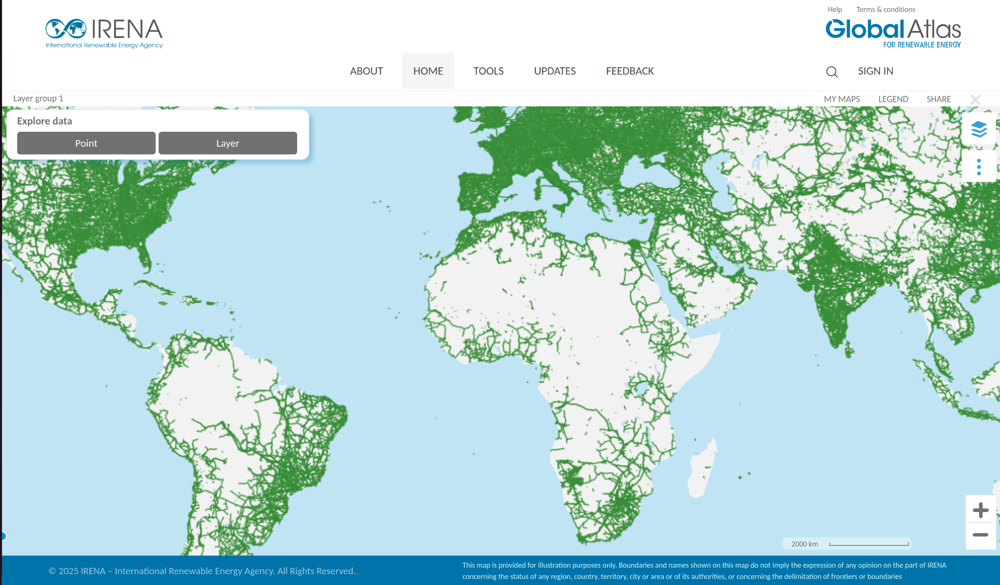

<h1>Impact of Open Electrical Grid Data </h1>

!!! question
    **Why "map"? Why place towers, lines, power plants and substations? Who and how is this information used?**  

    **Well, when you map towers, substations, powerplants in OpenStreetMap (OSM), you are essentially adding valuable data that is used by many different entities.**

## **
How and why is it used?
**

🔵 OpenStreetMap powergrid data is used by academia, institutions, local authorities and private organisations.

Energy modelling and planning tools use this data, to comprehensively inform policy and investment decision-making. From evaluating different energy scenarios, analysing different technologies and policies, to providing insights to achieve full electrification in developing countries, energy modelling tools are key to decarbonise the world's energy sector, as well as meeting development goals. However, these modelling results rely heavily on what goes in: **data**.

Good quality and up-to-date data are crucial to be able to accurately plan and invest in power infrastructure. Therefore, improving on the current state of the OpenStreetMap grid significantly increases the quality of these activities. For example, [PyPSA Earth](https://pypsa-earth.readthedocs.io/en/latest/index.html) (an open-source global cross-sectoral energy system model), uses OpenStreetMap grid data to build the electricity network in its framework.

⚪ Furthermore, our team also ran an "impact analysis" to see how many times the keywords _OpenStreetMap_ AND power related keywords (eg. _power grid_, _electrical grid_, _renewable_, _energy model_, etc...) were used together in google scholar. 

 - 📈 **10,700 publications** since 2005 included a combination of these keywords.
 - 🚀 **7,520 publications** (70% of total) were published in the **last 5 years alone**, which shows the increasingly important role OpenStreetMap power data is having in academia.

## **
Why is it important that this data are open?
**

🔶 Firstly, many developing countries' data is outdated, incomplete or scattered, which makes it harder for governments and utilities to plan grid and power developments. Although developed countries tend to have better quality network data, it can be often difficult to access as it is not always open or easily usable due to licensing. This also reduces transparency and makes it harder to cross-check results and collaborate, since data needs to be collected and re-collected often. 

🔷 Moreover, transparency of strategies and thus data is key for public acceptance of infrastructure expansions and investments ([Ciupuliga & Cuppen, 2013](https://www.sciencedirect.com/science/article/abs/pii/S0301421513003601)). Open-data can empower local governments, communities and NGO's to participate in energy planning, as well as improve and fix the data as OpenStreetMap is open. A good example of how mapping the grid has helped empower local communities, is YouthMappers' initiative in Sierra Leone. Their power grid mapping project enabled information about electricity infrastructure to be reliable and easily accessible, which helps local electricity agencies plan and reduces their costs (see this [paper](https://link.springer.com/chapter/10.1007/978-3-031-05182-1_11#:~:text=One%20of%20the%20things%20that,they%20start%20constructing%20electricity%20infrastructure)). Additionally, power infrastructure such as generation plants, transmission networks, substations, and distribution networks data are also important to evaluate the connectivity potential of isolated communities to the wider grid ([Arderne et al.2020](https://www.nature.com/articles/s41597-019-0347-4
)). Thus, mapping power infrastructure and having this data open, doesn't only help with energy planning for decarbonisation and clean energy, but also for electrification which is crucial for [innovation](https://link.springer.com/chapter/10.1007/978-3-031-05182-1_11#:~:text=One%20of%20the%20things%20that,they%20start%20constructing%20electricity%20infrastructure), [health, education and women's empowerment](https://www.ucl.ac.uk/bartlett/environment-energy-resources/sustainable/study/masters/alumni-and-student-experiences/energy-and-development-blogs/why-we-need-talk-about-energy-access-and-gender).

!!! quote
    Open data is crucial for innovation that will accelerate the energy system to Net Zero ([_Catapult Energy Systems_](https://es.catapult.org.uk/tools-and-labs/open-data/#:~:text=Open%20data%20is%20crucial%20for,energy%20system%20to%20Net%20Zero))

OpenStreetMap data is used by larger Organizations like the WorldBank or International Energy Agency as this dataset is the only source for regional and continental energy studies. Availability of data on public infrastructure in an open way through OpenStreetMap creates significant societal value for energy planning, security and clean energy transitions, as well as economic value for companies. A global challenge in the ongoing clean energy transitions is the growth and modernization of the transmission grid. The International Energy Agency (IEA) records on the necessity of grid information and data to tackle this challenge:

> **IEA key policy recommendation**: “Improve data reliability and availability to better assess and manage risks for clean energy projects in emerging markets and developing economies.”  [How to implement the COP28 energy goals](https://www.iea.org/events/from-taking-stock-to-taking-action-how-to-implement-the-cop28-energy-goals)

Availability of reliable data has therefore a direct impact on the adoption of clean energy projects. Clean energy projects around the globe are being currently pushed for three key reasons:

* Mitigate climate change as fossil fuels are responsible for 70 % of the greenhouse gas emissions,
* Strengthen resilience and increasing energy security against extreme weather events and mitigate the impacts of climate change,
* Increasing energy security by reducing energy dependency on imports from states perceived as unreliable or hostile.

For developing countries and emerging economies the expansion of the electricity grid plays a central role in granting access to electrification and clean energy. Electrification has been shown to be a key in reducing poverty and increasing economic stability. Access to clean energy, especially for cooking, has been a priority for improving public health especially among women and children. Delaying the expansion of electrical and renewable energy sources in these emerging regions creates risks entrenching fossil fuel dependency for decades, as seen in developed countries.

In particular, the scaling of this infrastructure in low to medium income countries has been hindered because of poor data quality and data governance on the state of the electrical grid. One reason for the low data quality is the obscurity of this data due to security concerns similar to security through obscurity practices in software development. This is why OpenStreetMap is so widely used in these areas. Another reasons for the lack of OpenStreetMap grid data in low- to medium-income countries is the poor quality and outdated nature of the satellite imagery provided by ESRI and Microsoft. 

For many developed countries, high-quality open data is published by companies or agencies outside of OpenStreetMap. For example [ENTSO-E publishes the Transmission System Map](https://www.entsoe.eu/data/map/) containing geo-information on transmission infrastructure across Europe. [The French operator of the transmission grid RTE publishes its grid topology including 5-minute resolution time-series](https://github.com/rte-france/structural-french-grid-data-with-detailed-topology-time-series). For the United States, agencies including the Department of Homeland Security publish and regularly update a dataset containing transmission grid information to support agencies, emergency response and economic development, with the publication of electronic geospatial dataset dating back [to legislation in the 1990s](https://www.govinfo.gov/content/pkg/WCPD-1994-04-18/pdf/WCPD-1994-04-18-Pg779.pdf). In comparison with OpenStreetMap data, the [Homeland Infrastructure Foundation-Level Data shows the high similarity between the two datasets](https://resilience.climate.gov/datasets/fedmaps::u-s-electric-power-transmission-lines/explore?location=38.846475%2C-76.984997%2C8.86). 

  
  <figcaption class="image-caption">
    The comparison between Homeland Infrastructure Foundation-Level Data (Grey Lines) and OpenStreetMap Transmission Grid data (Green Lines) shows that both datasets have the same spatial resolution.
  </figcaption>

## **
Who uses OpenStreetMap grid data?
**

How does mapping have an impact? When you map towers, substations, powerplants in OpenStreetMap (OSM), you are essentially adding valuable data that is used by many different entities. This data has been used by the following list of organisations, which is not exhaustive.
   

**International Energy Agency**  {width=30px} 
??? "Latin America Energy Outlook Interactive Map"
    
    === "[Latin America Energy Outlook Interactive Map (link)](https://www.iea.org/data-and-statistics/data-tools/latin-america-energy-outlook-interactive-map)"
        {: .img-border }

**World Bank**  {width=70px} 
??? "Africa Electricity Grids Explorer"
    
    === "[Africa Electricity Grids Explorer (link)](https://africagrid.energydata.info/)"
        {: .img-border }

**PyPSA-Earth** {: width=70px} **+** **PyPSA-Eur** {: width=30px}
??? "PyPSA Earth and Europe use OpenStreetMap data for energy system studies all around the world."
    
    === "[PyPSA-Earth (link)](https://pypsa-earth.readthedocs.io/)"
        {: .img-border }

**Enedis**  {width=70px} 
??? "The French utility company Enedis, operating the electricity distribution network, mapped power poles and substations with the help of a strong local OpenStreetMap community."
    
    === "[Enedis (link)](https://enedis.openstreetmap.fr/)"
        {: .img-border }

**Global Renewables Watch**  {width=70px} 
??? "The Global Renewables Watch maps and measures renewable energy installations and their estimated capacities at the subnational, national, and global levels. The machine learning behind the detection process is mainly trained using OpenStreetMap data."
    
    === "[Global Renewables Watch (link)](https://www.globalrenewableswatch.org/)"
        {: .img-border }
 
**CONAHCYT (Gobierno de Mexico)**  {width=70px} 
??? "Mapa del Sistema Eléctrico Nacional"
    
    === "[Mapa del Sistema Eléctrico Nacional (link)](https://energia.conacyt.mx/planeas/electricidad/sistema-electrico-nacional)"
        {: .img-border }
 
**European Commission - Joint Research Centre**  {width=40px} 
??? "Africa Knowledge Platform"
    
    === "[Africa Knowledge Platform (link)](https://africa-knowledge-platform.ec.europa.eu/explore_maps)"
        {: .img-border }

    **More Information**
    - The electricity network data on the image is a mix of World Bank and OpenStreetMap data 
 
**IRENA**  {width=55px} 
??? "Global Atlas for Renewable Energy"
    
    === "[Global Atlas for Renewable Energy (link)](https://globalatlas.irena.org/workspace)"
        {: .img-border }
 
**Global Wind Atlas**  {width=15px} 
??? "Global Wind Atlas"
    
    === "[Global Wind Atlas (link)](https://globalwindatlas.info/en/)"
        {: .img-border }

**Fraunhofer ISE**  {width=45px} 
??? "Energy Charts"
    
    === "[Energy Charts(link)](https://www.energy-charts.info/map/map.htm?l=en&c=DE&country=DE&lines=1110000&pp-source=bnetza&pp-bitmap=none)"
        {: .img-border }

