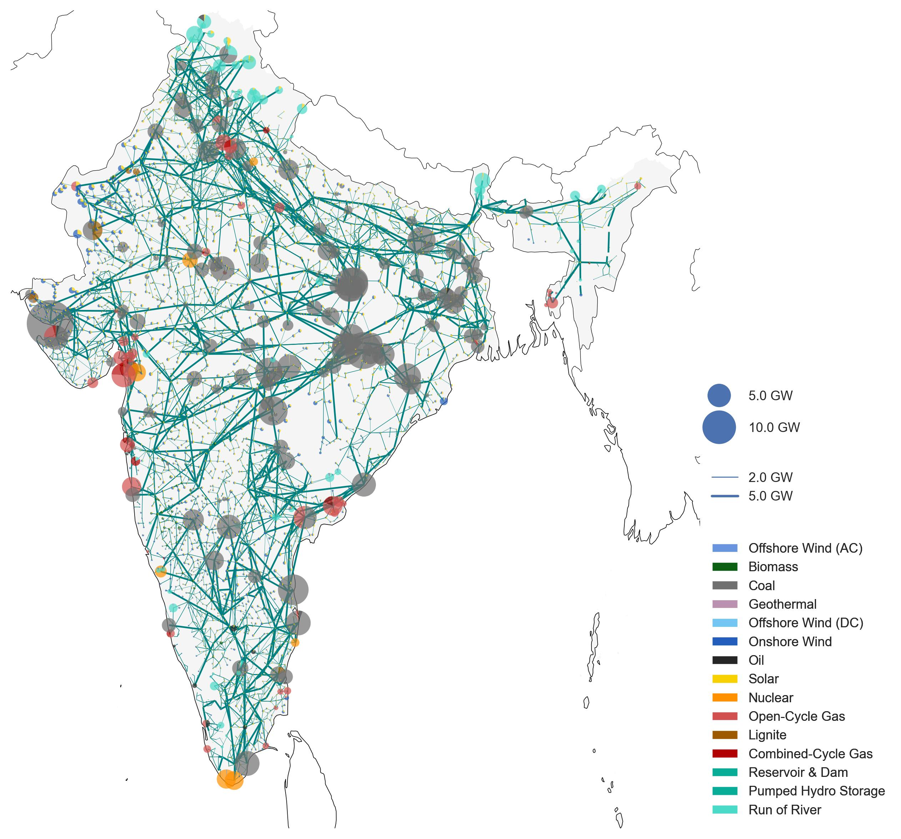

<h1>Impact of Open Electrical Grid Data </h1>

## **
How and why is it used?
**

**When you map towers, substations, powerplants in OpenStreetMap, you are essentially adding valuable data that is used by many different entities.** 

  
  <figcaption class="image-caption">The PyPSA-Earth open-source energy system model uses OpenStreetMap data to study the future of energy around the world.</figcaption>

 

OpenStreetMap’s electrical grid data is actively used by grid operators, academic institutions, government agencies, local authorities, and private organizations. This data plays a crucial role in energy modeling and planning, informing both policy development and investment decisions.

These simulations help evaluate technology options, policy impacts, and pathways to full electrification—especially in developing countries. Energy models are essential for advancing decarbonization goals and achieving sustainable development. However, the effectiveness of these models depends heavily on the **quality and completeness of the data** they rely on.

High-quality, up-to-date data is vital for planning and investing in power infrastructure. Enhancing the current state of the OpenStreetMap electrical grid significantly improves the reliability and impact of these planning tools. For example, [PyPSA Earth](https://pypsa-earth.readthedocs.io/en/latest/index.html), an open-source global energy system model, uses OpenStreetMap grid data as the foundation for constructing its electricity grid for [regions all around the world](https://pypsa-earth.readthedocs.io/en/latest/users_list.html#).

--- 

### Use by Major Institutions

Organizations such as the **World Bank** and the **International Energy Agency (IEA)** rely on OpenStreetMap data for regional and continental energy analyses. In many cases, OpenStreetMap provides the **only available** source of open, accessible infrastructure data. Making such data publicly available adds considerable **societal value** for planning and clean energy transitions, while also creating **economic value** for the private sector.

One of the major global challenges in the clean energy transition is the modernization and expansion of transmission infrastructure. The IEA emphasizes the need for reliable data and collaborative platforms to support this effort:

> **IEA Key Policy Recommendation in 2024:**
> “Improve data reliability and availability to better assess and manage risks for clean energy projects in emerging markets and developing economies.”           
[How to implement the COP28 energy goals](https://www.iea.org/events/from-taking-stock-to-taking-action-how-to-implement-the-cop28-energy-goals) 
--- 
> **IEA Actionable Recommendation in 2025:**
> “Policy makers, regulators and utilities must support institutions, regulations, technical standards and collaboration platforms to build consensus on effective planning approaches that take full account of the changes in the profiles of power systems and their operations. Encouraging TSOs to share procurement and capacity planning data with regulators will further support informed policymaking.       
[Building the Future Transmission Grid](https://iea.blob.core.windows.net/assets/a688d0f5-a100-447f-91a1-50b7b0d8eaa1/BuildingtheFutureTransmissionGrid.pdf)

### Energy Grids Shape Our Future

  
  <figcaption class="image-caption">Expanding and modernising grids is a key component of electricity security in each of the IEA scenarios. Adequate electricity transmission networks have strategic significance in outlooks that meet national and global climate goals.</figcaption>

 

Reliable and open infrastructure data directly supports the **adoption and success of clean energy projects** globally. These projects are being accelerated for several critical reasons:

* **Climate mitigation:** Fossil fuels account for roughly 70% of global greenhouse gas emissions.
* **Resilience:** Clean energy strengthens resilience against climate impacts and extreme weather events.
* **Energy security:** Reducing reliance on imports enhances national energy independence, especially from politically unstable or hostile regions.

### Growing Academic Impact

To understand the influence of OpenStreetMap electrical grid data in research, our team conducted an impact analysis using Google Scholar. We searched for publications combining **“OpenStreetMap”** with power-related terms such as **“power grid”**, **“electrical grid”**, **“renewable”**, and **“energy model.”**

* **10,700 publications** since 2005 included combinations of these keywords.
* **7,520 publications**—**70% of the total**—were published in just the last **five years**, demonstrating a rapid increase in academic engagement and recognition of OpenStreetMap power data.

## **
Why is it important that this data is open?
**

Access to open and accurate data on electricity infrastructure is essential for effective planning, development, and collaboration—especially in the context of the global energy transition. The benefits are far-reaching, particularly for developing countries and emerging economies.

### Bridging Data Gaps in Developing Countries

In many low- and middle-income countries, data on electrical infrastructure is **outdated, incomplete, or fragmented**. This presents a significant barrier for governments, utilities, and planners. Even in high-income countries, while data may be more comprehensive, it is often **not publicly available** or limited by restrictive licensing—hampering transparency and the ability to collaborate or validate results.

Open data ensures that:

* Infrastructure planning is **more inclusive and cost-effective**.
* Datasets can be **cross-checked, reused, and improved** collaboratively.
* Policymakers and planners have **a reliable foundation** for decision-making.

### Transparency and Public Trust

Transparent planning, backed by open data, plays a key role in building **public trust**. Research has shown that openness increases public acceptance of infrastructure projects ([Ciupuliga & Cuppen, 2013](https://www.sciencedirect.com/science/article/abs/pii/S0301421513003601)).

Because OpenStreetMap is editable and collaborative, **local communities, NGOs, and governments** can contribute directly—filling gaps, correcting errors, and improving the quality of infrastructure data. For example, the **YouthMappers** initiative in **Sierra Leone** enabled local students and organizations to map the power grid, helping electricity providers reduce planning costs and improve infrastructure deployment ([source](https://link.springer.com/chapter/10.1007/978-3-031-05182-1_11)).

Open grid data is also instrumental in identifying **off-grid communities** that could be connected to national networks, helping target interventions and investments ([Arderne et al., 2020](https://www.nature.com/articles/s41597-019-0347-4)).

### Enabling Broader Development Goals

Open data on energy infrastructure supports not just **decarbonization and electrification**, but broader human development outcomes. Electrification has been linked to:

* **Innovation** and entrepreneurship
* Improved **healthcare and education services**
* Enhanced **opportunities for women and girls**, especially where clean cooking access is introduced
  ([source](https://www.ucl.ac.uk/bartlett/environment-energy-resources/sustainable/study/masters/alumni-and-student-experiences/energy-and-development-blogs/why-we-need-talk-about-energy-access-and-gender))

> “**Open data is crucial for innovation that will accelerate the energy system to Net Zero.**”
> — [*Catapult Energy Systems*](https://es.catapult.org.uk/tools-and-labs/open-data/#:~:text=Open%20data%20is%20crucial%20for,energy%20system%20to%20Net%20Zero)

  
  <figcaption class="image-caption">Creating Foundation Electric Energy Infrastructure Data from Open-Sources document.</figcaption>

 

### Economic savings and benefits compared to proprietary datasets 

Open-source data from OpenStreetMap, have enabled government and local authorities to create high-quality datasets whilst not having to pay for high-cost proprietary datasets. For example, the US Department of Energy and partners have created the "Electric Energy Infrastructure Data" utilising open-source data, which led to **"estimated savings of 65% (~2 million dollars) over proprietary datasets"** ([source](https://www.energy.gov/sites/default/files/2023-01/poster-%20Creating%20Foundation%20Electric%20Energy%20Infrastructure%20Data%20from%20Open-Sources.pdf)).

 
### The Urgency for Open Data in Emerging Economies

Expanding access to electricity is vital for **poverty reduction, economic stability**, and **climate resilience**. However, one of the greatest barriers to grid expansion is the **lack of reliable data**. In some cases, data is deliberately withheld due to perceived security concerns, mirroring outdated "security through obscurity" practices in software development.

Where official data is lacking, **OpenStreetMap becomes the de facto platform** for mapping the grid. Yet even here, progress can be limited by the **quality of satellite imagery** available in some regions, with outdated or low-resolution images provided by services such as ESRI and Microsoft.

### Examples from High-Income Countries

In contrast, some developed countries publish detailed open datasets outside of OpenStreetMap. For example:

* [**ENTSO-E**](https://www.entsoe.eu/data/map/) provides a Europe-wide **Transmission System Map** with geo-referenced infrastructure data.
* The French grid operator **RTE** publishes its grid topology, including **5-minute resolution time-series data** on network operations ([RTE on GitHub](https://github.com/rte-france/structural-french-grid-data-with-detailed-topology-time-series)).

  
  <figcaption class="image-caption">
    Comparison of U.S. Homeland Infrastructure Foundation-Level Data (gray lines) with OpenStreetMap transmission data (green lines) shows matching spatial resolution.
  </figcaption>

In the United States, the Department of Homeland Security and other agencies publish national transmission grid data to support **emergency response, policy development, and economic planning**. These open datasets trace back to legislation from the 1990s that aimed to improve geospatial data sharing ([source](https://www.govinfo.gov/content/pkg/WCPD-1994-04-18/pdf/WCPD-1994-04-18-Pg779.pdf)).

The [Homeland Infrastructure Foundation-Level Data](https://resilience.climate.gov/datasets/fedmaps::u-s-electric-power-transmission-lines/explore?location=38.846475%2C-76.984997%2C8.86) has shown **strong alignment** with OpenStreetMap data, demonstrating how open contributions can match official datasets in coverage and accuracy.

## **
Who uses OpenStreetMap grid data?
**

How does mapping have an impact? When you map towers, substations, powerplants in OpenStreetMap, you are essentially adding valuable data that is used by many different entities. Below is a curated list of organisations and projects that have had an impact and have used this data.   

Disclaimer: These organisations are not affiliated with OhMyGrid nor endorse it. All logos and brand names are the property of their respective owners. Usage here is for informational purposes only, identifying organisations that utilise OpenStreetMap data.

**International Energy Agency**  {width=30px} 
??? "Energy and AI Observatory"
    
    === "[Energy and AI Observatory (link)](https://www.iea.org/data-and-statistics/data-tools/energy-and-ai-observatory)"
        {: .img-border }
 
??? "Latin America Energy Outlook Interactive Map"
    
    === "[Latin America Energy Outlook Interactive Map (link)](https://www.iea.org/data-and-statistics/data-tools/latin-america-energy-outlook-interactive-map)"
        {: .img-border }

**US Department of Homeland Security**  {width=30px} 
??? "Homeland Infrastructure Foundation-Level Data (HIFLD)"
    
    === "[Homeland Infrastructure Foundation-Level Data (HIFLD) (link)](https://hifld-geoplatform.hub.arcgis.com/datasets/3486fb60feb2454c99232248fdf624ec_0/explore)"
        {: .img-border }

**World Bank**  {width=70px} 
??? "Africa Electricity Grids Explorer"
    
    === "[Africa Electricity Grids Explorer (link)](https://africagrid.energydata.info/)"
        {: .img-border }

**PyPSA-Earth** {: width=70px} **+** **PyPSA-Eur** {: width=30px}
??? "PyPSA Earth and Europe use OpenStreetMap data for energy system studies all around the world."
    
    === "[PyPSA-Earth (link)](https://pypsa-earth.readthedocs.io/)"
        {: .img-border }

**Enedis**  {width=70px} 
??? "The French utility company Enedis, operating the electricity distribution network, mapped power poles and substations with the help of a strong local OpenStreetMap community."
    
    === "[Enedis (link)](https://enedis.openstreetmap.fr/)"
        {: .img-border }

**Global Renewables Watch**  {width=70px} 
??? "The Global Renewables Watch maps and measures renewable energy installations and their estimated capacities at the subnational, national, and global levels. The machine learning behind the detection process is mainly trained using OpenStreetMap data."
    
    === "[Global Renewables Watch (link)](https://www.globalrenewableswatch.org/)"
        {: .img-border }
 
**CONAHCYT (Gobierno de Mexico)**  {width=70px} 
??? "Mapa del Sistema Eléctrico Nacional"
    
    === "[Mapa del Sistema Eléctrico Nacional (link)](https://energia.conacyt.mx/planeas/electricidad/sistema-electrico-nacional)"
        {: .img-border }
 
**European Commission - Joint Research Centre**  {width=40px} 
??? "Africa Knowledge Platform"
    
    === "[Africa Knowledge Platform (link)](https://africa-knowledge-platform.ec.europa.eu/explore_maps)"
        {: .img-border }

    **More Information**
    - The electricity network data on the image is a mix of World Bank and OpenStreetMap data 
 
**IRENA**  {width=55px} 
??? "Global Atlas for Renewable Energy"
    
    === "[Global Atlas for Renewable Energy (link)](https://globalatlas.irena.org/workspace)"
        {: .img-border }
 
**Global Wind Atlas**  {width=15px} 
??? "Global Wind Atlas"
    
    === "[Global Wind Atlas (link)](https://globalwindatlas.info/en/)"
        {: .img-border }

**Fraunhofer ISE**  {width=45px} 
??? "Energy Charts"
    
    === "[Energy Charts(link)](https://www.energy-charts.info/map/map.htm?l=en&c=DE&country=DE&lines=1110000&pp-source=bnetza&pp-bitmap=none)"
        {: .img-border }

**ESMAP, IFC, VIDA** {width=45px} {width=65px} {width=45px}
??? "Distributed Renewable Energy (DRE) Atlas"
    
    === "[Distributed Renewable Energy (DRE) Atlas(link)](https://dre.energydata.info/)"
        {: .img-border }

**GridRaven** {width=15px} 
??? "Dynamic Line Ratings with precision weather forecasting"
    
    === "[Dynamic Line Ratings with precision weather forecasting](https://claw.gridraven.com/world)"
        {: .img-border }

**windPRO** {width=15px}
??? "windPRO is an industry standard for designing, planning, and evaluating wind and solar energy projects."
    
    === "[windPRO is an industry standard for designing, planning, and evaluating wind and solar energy projects](https://help.emd.dk/mediawiki/index.php/EMD_Electrical_Grid_Map)"
        {: .img-border } 

