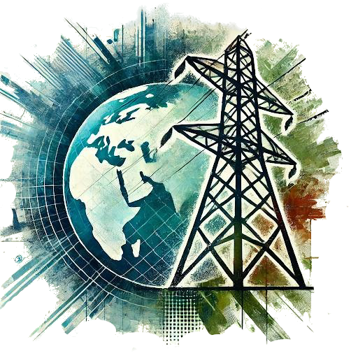
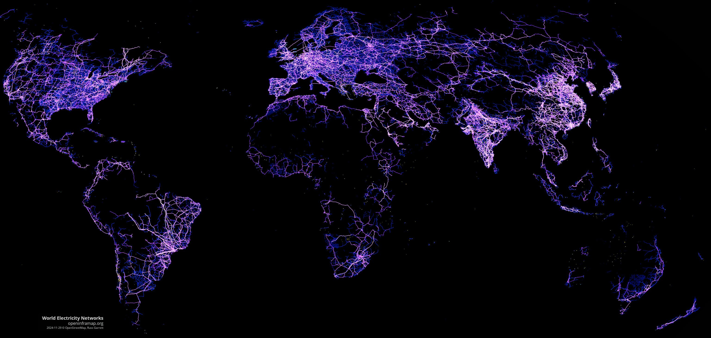
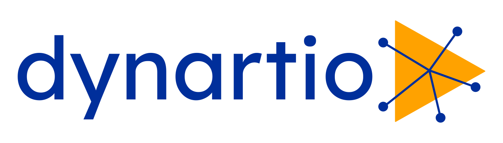

---
hide:
  - navigation
  - toc
  - footer
body_class: landing-page
---

  

    <h1 class="hero-title">OhMyGrid</h1>
    
 We empower individuals, communities and nations around the world to map the electrical grid.
    

    

     <a href="https://ohmygrid.org/map-it/" target="_blank" rel="noopener">
    🌍
    Map It 📍
     </a>
    

    

      <a href="https://discord.gg/a5znpdFWfD" target="_blank" rel="noopener">
         Discord
      </a>
      <a href="https://github.com/open-energy-transition/Oh-my-Grid" target="_blank" rel="noopener">
         GitHub
      </a>
      <a href="https://wiki.openstreetmap.org/wiki/Organised_Editing/Activities/Oh_my_grid_initiative" target="_blank" rel="noopener">
         Wiki
      </a>
    

  

  

    
  

  

    <h2>Why This Matters</h2>
    
 Transitioning away from fossil energy sources—which account for over 75% of global greenhouse gas emissions—requires rapid modernization of the <b>electrical grid</b>, <a href="https://iea.blob.core.windows.net/assets/70f2de45-6d84-4e07-bfd0-93833e205c81/ElectricityGridsandSecureEnergyTransitions.pdf" target="_blank" rel="noopener">a major bottleneck</a> to energy transition.

    
Despite the urgent need to expand the electricity grid, no open industrial data standard has been established for cross-border transmission. OpenStreetMap has emerged as the <b>unofficial de facto standard in academia and industry for grid data</b>. However, in developing countries, grid data remains poor, hindering both rural energy access and efforts to combat climate change:

    <blockquote>
      Improve data reliability and availability to better assess and manage risks for clean energy projects in emerging market and developing economies.
    </blockquote>
    

      Key Recommendation - International Energy Agency: <a href="https://www.iea.org/events/from-taking-stock-to-taking-action-how-to-implement-the-cop28-energy-goals" target="_blank" rel="noopener">How to implement the COP28 energy goals</a>
    

    
That's why <a href="https://openenergytransition.org/" target="_blank" rel="noopener">Open Energy Transition</a> has launched this open initiative in collaboration with <a href="https://datactivist.coop/en/" target="_blank" rel="noopener">Datactivist</a>, <a href="https://junglebus.io/" target="_blank" rel="noopener">Jungle Bus</a>, <a href="https://dynartio.com/" target="_blank" rel="noopener">Dynartio</a> and <a href="https://www.infrageomatics.com/" target="_blank" rel="noopener">Infrageomatics</a>. We are working with the OpenStreetMap community, organisations and individuals around the world to not only create an <a href="https://www.nature.com/articles/s41597-025-04550-7" target="_blank" rel="noopener">open digital twin of the European grid</a>, but also to expand the global coverage of the transmission grid in OpenStreetMap from around 70% to 98% over the next three years.
 

  
  
OpenStreetMap's already extensive data on the electrical grid can be browsed on <a href="https://openinframap.org/#3.34/8.66/41.06/B,E,L,N,P" target="_blank" rel="noopener">Open Infrastructure Map</a>, showing the global scale of data collected over more than 10 years, mostly by volunteers.

    
  

  <h2>Get Involved</h2>
  

    <a href="https://discord.gg/a5znpdFWfD" class="get-involved-card">
      <h3>Join Our Community</h3>
      
Connect with fellow contributors on Discord and participate in our community discussions.

    </a>
    <a href="https://ohmygrid.org/starter-kit/" class="get-involved-card">
      <h3>Start Mapping</h3>
      
Learn how to contribute to OpenStreetMap and help map the electrical grid in your area.

    </a>
    <a href="https://wiki.openstreetmap.org/wiki/Power_networks" class="get-involved-card">
      <h3>Contribute to the wiki</h3>
      
Help develop tools and improve countries' power networks page by including your progress.

    </a>
  

  <h2>Who We Are</h2>
  

    OhMyGrid is a free, open-source initiative supported by the following organisations. Would you like to join or support us? Contact <a href="mailto:ohmygrid@openenergytransition.org" target="_blank" rel="noopener">us via email</a>. 
  

  

      

      
        

    

      
    

        

      
    

    

      
    

    

      
    

  

