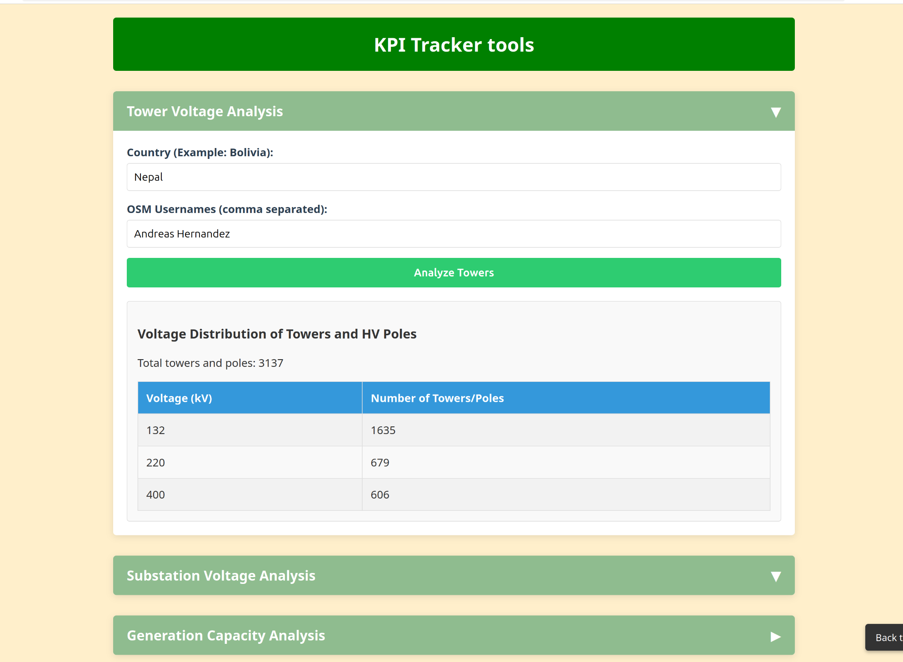

<h1>Our Progress and Country Logbook </h1>

OhMyGrid measures its progress at user, hashtag and country level. If you use our tools and training courses, we would be honored if you support our KPI. Just use the #OhMyGrid hashtag in your changesets or add your user id to our [KPI script](https://github.com/open-energy-transition/OhMyGrid/blob/main/.github/workflows/update-tower-count.yml).

<!-- Progress Bars Section -->
## **
Community Mapping Progress 
**

 
   <button id="refresh-btn" style="margin-bottom:1rem;">
     🔄 Refresh stats (only click if the bars are not "loading...")
   </button>

  

    <label>Contributors for <code>#ohmygrid</code>:</label>
    
 

 

    Loading…
  

  

    <label>Total Edits for <code>#ohmygrid</code>:</label>
    

      

 

    Loading…
  

  

    <label>Towers mapped by our team:</label>
    

      

    

    Loading…
     
    Last updated: —
  

  

    <label>Total estimated power line length added by our team (in km):</label>
    

      

    

    Loading… 
    
      Last updated: —
    
  

You can find more stats for #ohmygrid at [OhsomeNowstats](https://stats.now.ohsome.org/dashboard#hashtag=ohmygrid&start=2025-03-12T22:00:00Z&end=2025-05-14T21:59:59Z&interval=P1M&countries=&topics=).

<!-- LOGBOOK: Add your country below the last country. Some css (in extra.css at "Hide ### from logbook") is being used to remove the ### from the table of contents so please use the same name or tell me -->
<!-- End of country logbook -->
 
###Africa
{width=20px} [Angola](countrypages/Angola.md) - 
{width=20px} [Burkina Faso](countrypages/Burkina Faso.md) - 
{width=20px} [Burundi](countrypages/Burundi.md) - 
{width=20px} [Benin](countrypages/Benin.md) - 
{width=20px} [Botswana](countrypages/Botswana.md) - 
{width=20px} [Democratic Republic of the Congo](countrypages/Democratic Republic of the Congo.md) - 
{width=20px} [Central African Republic](countrypages/Central African Republic.md) - 
{width=20px} [Republic of the Congo](countrypages/Republic of the Congo.md) - 
{width=20px} [Ivory Coast](countrypages/Ivory Coast.md) - 
{width=20px} [Cameroon](countrypages/Cameroon.md) - 
{width=20px} [Cape Verde](countrypages/Cape Verde.md) - 
{width=20px} [Djibouti](countrypages/Djibouti.md) - 
{width=20px} [Algeria](countrypages/Algeria.md) - 
{width=20px} [Egypt](countrypages/Egypt.md) - 
{width=20px} [Eritrea](countrypages/Eritrea.md) - 
{width=20px} [Ethiopia](countrypages/Ethiopia.md) - 
{width=20px} [Gabon](countrypages/Gabon.md) - 
{width=20px} [Ghana](countrypages/Ghana.md) - 
{width=20px} [The Gambia](countrypages/The Gambia.md) - 
{width=20px} [Guinea](countrypages/Guinea.md) - 
{width=20px} [Equatorial Guinea](countrypages/Equatorial Guinea.md) - 
{width=20px} [Guinea-Bissau](countrypages/Guinea-Bissau.md) - 
{width=20px} [Kenya](countrypages/Kenya.md) - 
{width=20px} [Comoros](countrypages/Comoros.md) - 
{width=20px} [Liberia](countrypages/Liberia.md) - 
{width=20px} [Lesotho](countrypages/Lesotho.md) - 
{width=20px} [Libya](countrypages/Libya.md) - 
{width=20px} [Morocco](countrypages/Morocco.md) - 
{width=20px} [Madagascar](countrypages/Madagascar.md) - 
{width=20px} [Mali](countrypages/Mali.md) - 
{width=20px} [Mauritania](countrypages/Mauritania.md) - 
{width=20px} [Mauritius](countrypages/Mauritius.md) - 
{width=20px} [Malawi](countrypages/Malawi.md) - 
{width=20px} [Mozambique](countrypages/Mozambique.md) - 
{width=20px} [Namibia](countrypages/Namibia.md) - 
{width=20px} [Niger](countrypages/Niger.md) - 
{width=20px} [Nigeria](countrypages/Nigeria.md) - 
{width=20px} [Rwanda](countrypages/Rwanda.md) - 
{width=20px} [Seychelles](countrypages/Seychelles.md) - 
{width=20px} [Sudan](countrypages/Sudan.md) - 
{width=20px} [Sierra Leone](countrypages/Sierra Leone.md) - 
{width=20px} [Senegal](countrypages/Senegal.md) - 
{width=20px} [Somalia](countrypages/Somalia.md) - 
{width=20px} [South Sudan](countrypages/South Sudan.md) - 
{width=20px} [São Tomé and Príncipe](countrypages/São Tomé and Príncipe.md) - 
{width=20px} [Eswatini](countrypages/Eswatini.md) - 
{width=20px} [Chad](countrypages/Chad.md) - 
{width=20px} [Togo](countrypages/Togo.md) - 
{width=20px} [Tunisia](countrypages/Tunisia.md) - 
{width=20px} [Tanzania](countrypages/Tanzania.md) - 
{width=20px} [Uganda](countrypages/Uganda.md) - 
{width=20px} [South Africa](countrypages/South Africa.md) - 
{width=20px} [Zambia](countrypages/Zambia.md) - 
{width=20px} [Zimbabwe](countrypages/Zimbabwe.md) - 

###Asia
{width=20px} [United Arab Emirates](countrypages/United Arab Emirates.md) - 
{width=20px} [Afghanistan](countrypages/Afghanistan.md) - 
{width=20px} [Armenia](countrypages/Armenia.md) - 
{width=20px} [Azerbaijan](countrypages/Azerbaijan.md) - 
{width=20px} [Bangladesh](countrypages/Bangladesh.md) - 
{width=20px} [Bahrain](countrypages/Bahrain.md) - 
{width=20px} [Brunei](countrypages/Brunei.md) - 
{width=20px} [Bhutan](countrypages/Bhutan.md) - 
{width=20px} [People's Republic of China](countrypages/People's Republic of China.md) - 
{width=20px} [Indonesia](countrypages/Indonesia.md) - 
{width=20px} [Israel](countrypages/Israel.md) - 
{width=20px} [India](countrypages/India.md) - 
{width=20px} [Iraq](countrypages/Iraq.md) - 
{width=20px} [Iran](countrypages/Iran.md) - 
{width=20px} [Jordan](countrypages/Jordan.md) - 
{width=20px} [Japan](countrypages/Japan.md) - 
{width=20px} [Kyrgyzstan](countrypages/Kyrgyzstan.md) - 
{width=20px} [Cambodia](countrypages/Cambodia.md) - 
{width=20px} [North Korea](countrypages/North Korea.md) - 
{width=20px} [South Korea](countrypages/South Korea.md) - 
{width=20px} [Kuwait](countrypages/Kuwait.md) - 
{width=20px} [Kazakhstan](countrypages/Kazakhstan.md) - 
{width=20px} [Laos](countrypages/Laos.md) - 
{width=20px} [Lebanon](countrypages/Lebanon.md) - 
{width=20px} [Sri Lanka](countrypages/Sri Lanka.md) - 
{width=20px} [Myanmar](countrypages/Myanmar.md) - 
{width=20px} [Mongolia](countrypages/Mongolia.md) - 
{width=20px} [Maldives](countrypages/Maldives.md) - 
{width=20px} [Malaysia](countrypages/Malaysia.md) - 
{width=20px} [Nepal](countrypages/Nepal.md) - 
{width=20px} [Oman](countrypages/Oman.md) - 
{width=20px} [Philippines](countrypages/Philippines.md) - 
{width=20px} [Pakistan](countrypages/Pakistan.md) - 
{width=20px} [State of Palestine](countrypages/State of Palestine.md) - 
{width=20px} [Qatar](countrypages/Qatar.md) - 
{width=20px} [Saudi Arabia](countrypages/Saudi Arabia.md) - 
{width=20px} [Singapore](countrypages/Singapore.md) - 
{width=20px} [Syria](countrypages/Syria.md) - 
{width=20px} [Thailand](countrypages/Thailand.md) - 
{width=20px} [Tajikistan](countrypages/Tajikistan.md) - 
{width=20px} [Timor-Leste](countrypages/Timor-Leste.md) - 
{width=20px} [Turkmenistan](countrypages/Turkmenistan.md) - 
{width=20px} [Turkey](countrypages/Turkey.md) - 
{width=20px} [Taiwan](countrypages/Taiwan.md) - 
{width=20px} [Uzbekistan](countrypages/Uzbekistan.md) - 
{width=20px} [Vietnam](countrypages/Vietnam.md) - 
{width=20px} [Yemen](countrypages/Yemen.md) - 

###Europe
{width=20px} [Andorra](countrypages/Andorra.md) - 
{width=20px} [Albania](countrypages/Albania.md) - 
{width=20px} [Austria](countrypages/Austria.md) - 
{width=20px} [Bosnia and Herzegovina](countrypages/Bosnia and Herzegovina.md) - 
{width=20px} [Belgium](countrypages/Belgium.md) - 
{width=20px} [Bulgaria](countrypages/Bulgaria.md) - 
{width=20px} [Belarus](countrypages/Belarus.md) - 
{width=20px} [Switzerland](countrypages/Switzerland.md) - 
{width=20px} [Cyprus](countrypages/Cyprus.md) - 
{width=20px} [Czech Republic](countrypages/Czech Republic.md) - 
{width=20px} [Germany](countrypages/Germany.md) - 
{width=20px} [Kingdom of Denmark](countrypages/Kingdom of Denmark.md) - 
{width=20px} [Estonia](countrypages/Estonia.md) - 
{width=20px} [Spain](countrypages/Spain.md) - 
{width=20px} [Finland](countrypages/Finland.md) - 
{width=20px} [France](countrypages/France.md) - 
{width=20px} [United Kingdom](countrypages/United Kingdom.md) - 
{width=20px} [Georgia](countrypages/Georgia.md) - 
{width=20px} [Greece](countrypages/Greece.md) - 
{width=20px} [Croatia](countrypages/Croatia.md) - 
{width=20px} [Hungary](countrypages/Hungary.md) - 
{width=20px} [Ireland](countrypages/Ireland.md) - 
{width=20px} [Iceland](countrypages/Iceland.md) - 
{width=20px} [Italy](countrypages/Italy.md) - 
{width=20px} [Liechtenstein](countrypages/Liechtenstein.md) - 
{width=20px} [Lithuania](countrypages/Lithuania.md) - 
{width=20px} [Luxembourg](countrypages/Luxembourg.md) - 
{width=20px} [Latvia](countrypages/Latvia.md) - 
{width=20px} [Monaco](countrypages/Monaco.md) - 
{width=20px} [Moldova](countrypages/Moldova.md) - 
{width=20px} [Montenegro](countrypages/Montenegro.md) - 
{width=20px} [North Macedonia](countrypages/North Macedonia.md) - 
{width=20px} [Malta](countrypages/Malta.md) - 
{width=20px} [Kingdom of the Netherlands](countrypages/Kingdom of the Netherlands.md) - 
{width=20px} [Norway](countrypages/Norway.md) - 
{width=20px} [Poland](countrypages/Poland.md) - 
{width=20px} [Portugal](countrypages/Portugal.md) - 
{width=20px} [Romania](countrypages/Romania.md) - 
{width=20px} [Serbia](countrypages/Serbia.md) - 
{width=20px} [Russia](countrypages/Russia.md) - 
{width=20px} [Sweden](countrypages/Sweden.md) - 
{width=20px} [Slovenia](countrypages/Slovenia.md) - 
{width=20px} [Slovakia](countrypages/Slovakia.md) - 
{width=20px} [San Marino](countrypages/San Marino.md) - 
{width=20px} [Ukraine](countrypages/Ukraine.md) - 
{width=20px} [Vatican City](countrypages/Vatican City.md) - 

###North America
{width=20px} [Antigua and Barbuda](countrypages/Antigua and Barbuda.md) - 
{width=20px} [Barbados](countrypages/Barbados.md) - 
{width=20px} [The Bahamas](countrypages/The Bahamas.md) - 
{width=20px} [Belize](countrypages/Belize.md) - 
{width=20px} [Canada](countrypages/Canada.md) - 
{width=20px} [Costa Rica](countrypages/Costa Rica.md) - 
{width=20px} [Cuba](countrypages/Cuba.md) - 
{width=20px} [Dominica](countrypages/Dominica.md) - 
{width=20px} [Dominican Republic](countrypages/Dominican Republic.md) - 
{width=20px} [Grenada](countrypages/Grenada.md) - 
{width=20px} [Guatemala](countrypages/Guatemala.md) - 
{width=20px} [Honduras](countrypages/Honduras.md) - 
{width=20px} [Haiti](countrypages/Haiti.md) - 
{width=20px} [Jamaica](countrypages/Jamaica.md) - 
{width=20px} [Saint Kitts and Nevis](countrypages/Saint Kitts and Nevis.md) - 
{width=20px} [Saint Lucia](countrypages/Saint Lucia.md) - 
{width=20px} [Mexico](countrypages/Mexico.md) - 
{width=20px} [Nicaragua](countrypages/Nicaragua.md) - 
{width=20px} [El Salvador](countrypages/El Salvador.md) - 
{width=20px} [Trinidad and Tobago](countrypages/Trinidad and Tobago.md) - 
{width=20px} [United States](countrypages/United States.md) - 
{width=20px} [Saint Vincent and the Grenadines](countrypages/Saint Vincent and the Grenadines.md) - 

###Oceania
{width=20px} [Australia](countrypages/Australia.md) - 
{width=20px} [Fiji](countrypages/Fiji.md) - 
{width=20px} [Federated States of Micronesia](countrypages/Federated States of Micronesia.md) - 
{width=20px} [Kiribati](countrypages/Kiribati.md) - 
{width=20px} [Marshall Islands](countrypages/Marshall Islands.md) - 
{width=20px} [Nauru](countrypages/Nauru.md) - 
{width=20px} [New Zealand](countrypages/New Zealand.md) - 
{width=20px} [Papua New Guinea](countrypages/Papua New Guinea.md) - 
{width=20px} [Palau](countrypages/Palau.md) - 
{width=20px} [Solomon Islands](countrypages/Solomon Islands.md) - 
{width=20px} [Tonga](countrypages/Tonga.md) - 
{width=20px} [Tuvalu](countrypages/Tuvalu.md) - 
{width=20px} [Vanuatu](countrypages/Vanuatu.md) - 
{width=20px} [Samoa](countrypages/Samoa.md) - 

###South America
{width=20px} [Argentina](countrypages/Argentina.md) - 
{width=20px} [Bolivia](countrypages/Bolivia.md) - 
{width=20px} [Brazil](countrypages/Brazil.md) - 
{width=20px} [Chile](countrypages/Chile.md) - 
{width=20px} [Colombia](countrypages/Colombia.md) - 
{width=20px} [Ecuador](countrypages/Ecuador.md) - 
{width=20px} [Guyana](countrypages/Guyana.md) - 
{width=20px} [Panama](countrypages/Panama.md) - 
{width=20px} [Peru](countrypages/Peru.md) - 
{width=20px} [Paraguay](countrypages/Paraguay.md) - 
{width=20px} [Suriname](countrypages/Suriname.md) - 
{width=20px} [Uruguay](countrypages/Uruguay.md) - 
{width=20px} [Venezuela](countrypages/Venezuela.md) - 

## [**Nepal**](https://wiki.openstreetmap.org/wiki/Power_networks/Nepal) 🇳🇵 
??? success "Mapping progress example"
    **Progress timeline**
    
    === "Before (April 2025)"
        {: .img-border }
        *April 8th, 2025*
        
    === "After (May 2025)"
        {: .img-border }
        *May 2, 2025*

    ### Success stories 
    - Added Nepal's largest power plant (456 MW)
    - Mapped 132kv Nepal-India interconnector
    - Finalised 400kv lines
    - Connected Pokhara-Butwal substations

    ### Key numbers 
    - **+3137** power towers added (10k total)
    - **+1120km** power lines (44% increase, as prior to our mapping, the transmission grid was 2560km)
    - **+980 MW** added capacity (1260 MW total)

##**Want to track and see your personal mapping progress (KPI)? :white_check_mark:**  
This [repository](https://github.com/open-energy-transition/KPI-OSM/tree/main) has a few different scripts (Overpass and Python) to measure your KPI's, as well as a [web-interface](https://open-energy-transition.github.io/KPI-OSM/). You can see how many towers you have placed and the respective line voltage, the power line length you have edited in km, the amount of MW capacity you added as a % of the country's mapped capacity, and a distribution table by voltage of substations you have added.  

  
  

