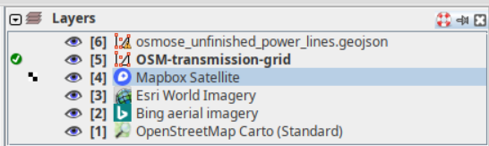
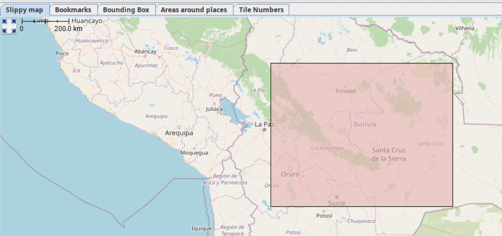

# **Grid Mapping starter kit**
A [starter kit](https://github.com/open-energy-transition/grid-mapping-starter-kit) for Electrical Transmission Grid Mapping in OpenStreetMap, combining Osmose and Overpass with JOSM.

  
  

## Setup JOSM on your device :rocket:

  

1\. Install [Java](https://www.java.com/en/download/help/download_options.html) on your device if not installed.  
2\. Install [JOSM](https://josm.openstreetmap.de/) on your device. 
3\. (Optional) If you want preconfigured preferences, download this preferences.xml [file](https://github.com/open-energy-transition/grid-mapping-starter-kit/blob/main/josm-config/preferences.xml) and paste it in the correct folder on your device. The [JOSM wiki](https://josm.openstreetmap.de/wiki/Help/Preferences) provides details on where to place it.<!-- No space here -->

  

4\. Add our custom paint style which you can find [here](https://github.com/open-energy-transition/grid-mapping-starter-kit/blob/main/josm-config/transmission_grid_mapping_style.mapcss). To add to JOSM, go to Edit>Preferences>Map Paint Styles and press the "+" in the top right. Then you can paste this [URL](https://raw.githubusercontent.com/open-energy-transition/grid-mapping-starter-kit/refs/heads/main/josm-config/transmission_grid_mapping_style.mapcss) or the file saved on your device. 
5. Download this [template](https://github.com/open-energy-transition/grid-mapping-starter-kit/blob/main/josm-config/transmission_grid_mapping_template.joz) session, and in JOSM go to File>Open and open the .joz file.  
6. Create an OSM [account](https://www.openstreetmap.org/user/new?cookie_test=true) if you don't have one. Once you do, go to Edit>Preferences>OSM Server and press authorise now. Login with your OSM account, and authorise. Your account is now linked to JOSM on your device.  
7. Finally, activate "expert mode" in View>Expert mode. This will enable using Overpass API. Also, make sure remote control is enabled in Edit>Preferences>Remote Control. You will need this enabled for the next step!

## Downloading transmission data such as power lines, substations, power plants. :inbox_tray:

  

1\. Make sure the layer that is activated is the "osm-transmission-grid" layer, and press the green "Download" button.
Switch to the Download from Overpass API tab. Paste [this](https://github.com/open-energy-transition/grid-mapping-starter-kit/blob/main/josm-config/transmission-grid.overpassql) overpassql query.  

  

2\. Select the Slippy Map tab in the Download from Overpass API and draw a bounding box for the country or region you want to map. (See at the bottom of this page the full explanation of how it currently is working if you want). With the red bounding box, try and put the centre of the box around the centre of the country or where you can see the name of the country. If you want to only map a region, you will have to change the admin_level to 4 in the script.

3\. Press Download. This will fetch for all the power infrastructure in the country/region. If "No info is found", then try again making sure the bounding box is over the name of the country and more or less centered.

## How to Map and upload your progress :outbox_tray:

  

1\. For ease of mapping, customise your toolbar with presets if you have not used the default preferences. Edit → Preferences → Toolbar. Then select the Presets → Man Made → Man Made/Power and add power towers, power portals and other presets for your mapping acticity.

  

2\. Start Mapping. Read more about the general mapping process in JOSM. Place nodes (eg.power towers, power portals) or place polygons to delimit an area (eg. substation, generator), and press on the preset structure you want it to be.   :pencil: Example: As seen in the image to the right, the red polygon is a substation which is mapped by adding nodes that are connected to each other and tagges as a substation.  

3\. Whilst having the OpenStreetMap layer activated, press the green Upload arrow. Avoid ignoring validation results. The only acceptable warning when uploading data is "Possible missing line support node within power line".

 :question: How the bounding box currently works with our Overpass query:  
Currently, the boundary of the country we want is associated to the "country node". This node tends to be where the name of the country is on the map or around the center of the country. If this node is within the bounding box then the query should work. To verify where the node is (useful if mapping regions for example), you can check on OpenStreetMap for the node's exact location.

⭐ More info can be found at the [repository](https://github.com/open-energy-transition/grid-mapping-starter-kit)
