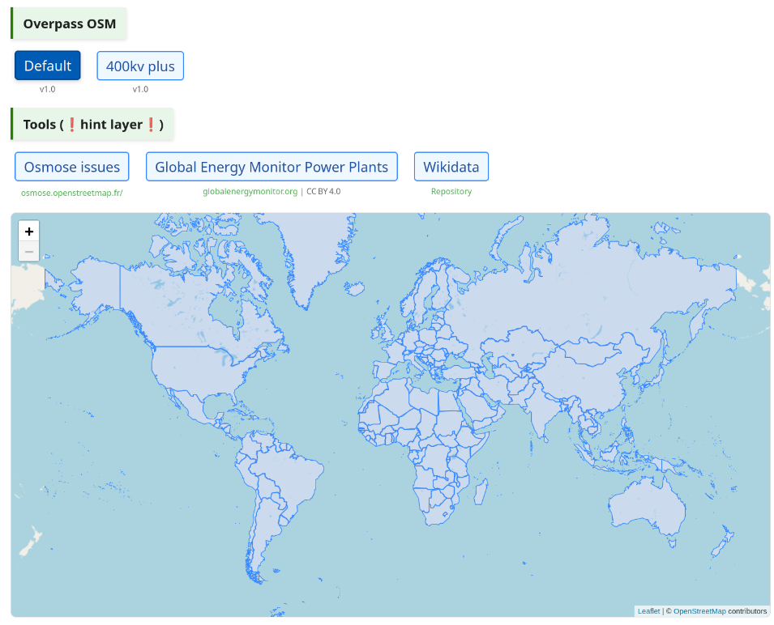
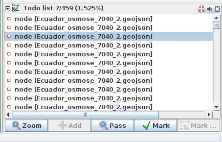

<h1>Grid Mapping Starter Kit 🌱</h1>

A [starter kit](https://github.com/open-energy-transition/grid-mapping-starter-kit) for Electrical Transmission Grid Mapping in OpenStreetMap, combining Osmose and Overpass with JOSM.

  
  

## **
Get started with OpenStreetMap and Open Infrastructure Map 🗺️
**

  
  <figcaption class="image-caption">Open infrastructure map showing the highly detailed transmission and distribution grid in Portugal.</figcaption>

If you don't already have an OpenStreetMap account, [create one first](https://www.openstreetmap.org/user/new). If you're new to OpenStreetMap, now is a good time to learn the basics of editing using the in-browser editor (iD) - find something which is missing from the map in your local area and add it! The [OpenStreetMap Wiki](https://wiki.openstreetmap.org) has lots of information about how to map with OpenStreetMap, and you can start by reading the [iD Beginners' Guide](https://learnosm.org/en/beginner/id-editor/). Adding missing power towers or substations can significantly improve mapping progress, as it gives other mappers a clue as to where parts of the entire grid are missing. To quickly check if anything is missing near you, go to the Open Infrastructure Map. Press the 'Find my location' button in the top right corner or enter your town in the search box. See something missing next to you? Map it using your iD editor. Don't worry about making mistakes. Mapping is an iterative process, and the OpenStreetMap community automatically detects anything that is missing. The OpenStreetMap Wiki pages [The Power Network](https://wiki.openstreetmap.org/wiki/Power_networks) and [Key:Power](https://wiki.openstreetmap.org/wiki/Key:power) provide an overview of how to map different power infrastructure.

**⚠️ Before you start mapping, please find out about the mapping restrictions in the respective country. In some countries, the mapping of transmission lines is not permitted. Get in touch with local users by finding out about [local projects](https://wiki.openstreetmap.org/wiki/Power_networks). ⚠️**

## **
Install JOSM :rocket:
**

JOSM is a more advanced desktop OpenStreetMap editor which is more suitable for power grid mapping.

  

!!! note
    The JOSM Preferences window is accessed through the `Edit → Preferences` menu on Windows and Linux, and `JOSM → Settings` on Mac.

1\. Install [Java](https://www.java.com/en/download/help/download_options.html) on your device if not installed.  
2\. Install [JOSM](https://josm.openstreetmap.de/) on your device. 
3\. (Optional) If you want preconfigured preferences, download this preferences.xml [file](https://github.com/open-energy-transition/grid-mapping-starter-kit/blob/main/josm-config/preferences.xml) and paste it in the correct folder on your device. The [JOSM wiki](https://josm.openstreetmap.de/wiki/Help/Preferences) provides details on where to place it.<!-- No space here -->
4\. Further instructions on how to install and use JOSM on your device can be found at [learnOSM](https://learnosm.org/en/josm/start-josm/).  

4\. Add our custom paint style which you can find [here](https://github.com/open-energy-transition/grid-mapping-starter-kit/blob/main/josm-config/transmission_grid_mapping_style.mapcss). To add to JOSM, go to `Preferences → Map Paint Styles` and press the "+" in the top right. Then you can paste this [URL](https://raw.githubusercontent.com/open-energy-transition/grid-mapping-starter-kit/refs/heads/main/josm-config/transmission_grid_mapping_style.mapcss) or the file saved on your device. We recommend using this MapCSS file for [low-density grids](https://raw.githubusercontent.com/open-energy-transition/grid-mapping-starter-kit/refs/heads/main/josm-config/low_density_transmission_grid_mapping_style.mapcss) and this one for [high-density grids](https://raw.githubusercontent.com/open-energy-transition/grid-mapping-starter-kit/refs/heads/main/josm-config/high_density_transmission_grid_mapping_style.mapcss). You can use [ColorMyMap!](https://github.com/open-energy-transition/color_my_map), our MapCSS Generator tool, to easily adapt the MapCSS file to fit any special requirements you might have.
Below is a high level legend of the color styles of the mapcss 

<h4>MapCSS Style Legend</h4>

<svg xmlns="http://www.w3.org/2000/svg" viewBox="0 0 800 700" font-family="Arial, sans-serif">
  <!-- Background -->
  <rect width="800" height="700" fill="#e6e6e6" rx="10" ry="10"/>
  
  <!-- Title -->
  <text x="400" y="40" font-size="24" font-weight="bold" text-anchor="middle">Transmission Grid Mapping Legend</text>
  
  <!-- Section Titles -->
  <text x="150" y="78" font-size="18" font-weight="bold" fill="green">Power Lines by Voltage</text>
  <text x="550" y="78" font-size="18" font-weight="bold" fill="green">Node Types</text>
  <text x="150" y="323" font-size="18" font-weight="bold" fill="green">Line Properties</text>
  <text x="550" y="323" font-size="18" font-weight="bold" fill="green">Power Stations &amp; Areas</text>
  <text x="350" y="523" font-size="18" font-weight="bold" fill="green">Generator Sources</text>
  
  <!-- Power Lines by Voltage -->
  <g transform="translate(60, 100)">
    <!-- Under 132kV -->
    <line x1="0" y1="25" x2="80" y2="25" stroke="BurlyWood" stroke-width="4" stroke-linecap="round"/>
    <text x="90" y="30" font-size="14">Under 132kV</text>
    
    <!-- 132-220kV -->
    <line x1="0" y1="55" x2="80" y2="55" stroke="Coral" stroke-width="4" stroke-linecap="round"/>
    <text x="90" y="60" font-size="14">132-220kV</text>
    
    <!-- 220-310kV -->
    <line x1="0" y1="85" x2="80" y2="85" stroke="IndianRed" stroke-width="4" stroke-linecap="round"/>
    <text x="90" y="90" font-size="14">220-310kV</text>
    
    <!-- 310-550kV -->
    <line x1="0" y1="115" x2="80" y2="115" stroke="DarkViolet" stroke-width="4" stroke-linecap="round"/>
    <text x="90" y="120" font-size="14">310-550kV</text>
    
    <!-- >550kV -->
    <line x1="0" y1="145" x2="80" y2="145" stroke="DarkTurquoise" stroke-width="4" stroke-linecap="round"/>
    <text x="90" y="150" font-size="14">Above 550kV</text>
    
    <!-- No voltage -->
    <line x1="0" y1="175" x2="80" y2="175" stroke="white" stroke-width="4" stroke-linecap="round"/>
    <rect x="-2" y="173" width="84" height="4" stroke="black" stroke-width="0.5" fill="none"/>
    <text x="90" y="180" font-size="14">No voltage data</text>
  </g>
  
  <!-- Node Types -->
  <g transform="translate(460, 100)">
    <!-- Tower -->
    <rect x="0" y="15" width="20" height="20" fill="blue" stroke="black" stroke-width="0.5"/>
    <text x="30" y="30" font-size="14">Tower</text>
    
    <!-- Pole -->
    <rect x="0" y="45" width="20" height="20" fill="black" stroke="black" stroke-width="0.5"/>
    <text x="30" y="60" font-size="14">Pole</text>
    
    <!-- Substation -->
    <rect x="0" y="75" width="20" height="20" fill="white" stroke="black" stroke-width="1"/>
    <text x="30" y="90" font-size="14">Substation</text>
    
    <!-- Transmission Substation -->
    <rect x="0" y="105" width="20" height="20" fill="#DC143C" stroke="#DC143C" stroke-width="1.5"/>
    <text x="30" y="120" font-size="14">Transmission Substation</text>
    
    <!-- Distribution Substation -->
    <rect x="0" y="135" width="20" height="20" fill="#008F11" stroke="#008F11" stroke-width="1.5"/>
    <text x="30" y="150" font-size="14">Distribution Substation</text>
    
    <!-- Generator -->
    <rect x="0" y="165" width="20" height="20" fill="yellow" stroke="black" stroke-width="0.5"/>
    <text x="30" y="180" font-size="14">Generator</text>
    
    <!-- Switch -->
    <rect x="0" y="195" width="20" height="20" fill="red" stroke="black" stroke-width="0.5"/>
    <text x="30" y="210" font-size="14">Switch</text>
  </g>
  
  <!-- Line Properties -->
  <g transform="translate(60, 345)">
    <!-- Cable -->
    <line x1="0" y1="25" x2="80" y2="25" stroke="#888888" stroke-width="4" stroke-dasharray="9,9"/>
    <text x="90" y="30" font-size="14">Cable</text>
    
    <!-- Multi-circuit line -->
    <line x1="0" y1="55" x2="80" y2="55" stroke="DarkViolet" stroke-width="4"/>
    <line x1="0" y1="55" x2="80" y2="55" stroke="#555555" stroke-width="8" stroke-dasharray="2,14"/>
    <text x="90" y="60" font-size="14">Multi-circuit Line</text>
    
    <!-- Proposed/Construction -->
    <line x1="0" y1="85" x2="80" y2="85" stroke="IndianRed" stroke-width="4" stroke-dasharray="8,4"/>
    <text x="90" y="90" font-size="14">Proposed/Construction</text>
    
    <!-- Bridge -->
    <line x1="0" y1="115" x2="80" y2="115" stroke="#0000FF" stroke-width="7"/>
    <line x1="0" y1="115" x2="80" y2="115" stroke="Coral" stroke-width="4"/>
    <text x="90" y="120" font-size="14">Bridge Crossing</text>
    
    <!-- Tunnel -->
    <line x1="0" y1="145" x2="80" y2="145" stroke="#964B00" stroke-width="7"/>
    <line x1="0" y1="145" x2="80" y2="145" stroke="Coral" stroke-width="4"/>
    <text x="90" y="150" font-size="14">Tunnel Crossing</text>
  </g>
  
  <!-- Power Stations & Areas -->
  <g transform="translate(460, 345)">
    <!-- Power Plant -->
    <rect x="0" y="15" width="30" height="20" fill="black" stroke="black" stroke-width="1.5"/>
    <text x="40" y="30" font-size="14">Power Plant</text>
    
    <!-- Industrial Area -->
    <rect x="0" y="45" width="30" height="20" fill="none" stroke="darkorange" stroke-width="2" stroke-dasharray="4,4"/>
    <text x="40" y="60" font-size="14">Industrial Area</text>
    
    <!-- Busbar -->
    <line x1="0" y1="75" x2="30" y2="75" stroke="#888888" stroke-width="4"/>
    <line x1="0" y1="75" x2="30" y2="75" stroke="#FFD800" stroke-width="6"/>
    <text x="40" y="80" font-size="14">Busbar</text>
    
    <!-- Bay -->
    <line x1="0" y1="105" x2="30" y2="105" stroke="#888888" stroke-width="4"/>
    <line x1="0" y1="105" x2="30" y2="105" stroke="#555555" stroke-width="6"/>
    <text x="40" y="110" font-size="14">Bay</text>
  </g>
  
  <!-- Generator Sources -->
  <g transform="translate(200, 540)">
    <!-- Nuclear -->
    <circle cx="15" cy="15" r="15" fill="yellow" stroke="black" stroke-width="0.5"/>
    <text x="15" y="45" font-size="14" text-anchor="middle">Nuclear</text>
    
    <!-- Wind -->
    <circle cx="65" cy="15" r="15" fill="lightblue" stroke="black" stroke-width="0.5"/>
    <text x="65" y="45" font-size="14" text-anchor="middle">Wind</text>
    
    <!-- Hydro -->
    <circle cx="115" cy="15" r="15" fill="blue" stroke="black" stroke-width="0.5"/>
    <text x="115" y="45" font-size="14" text-anchor="middle">Hydro</text>
    
    <!-- Solar -->
    <circle cx="165" cy="15" r="15" fill="orange" stroke="black" stroke-width="0.5"/>
    <text x="165" y="45" font-size="14" text-anchor="middle">Solar</text>
    
    <!-- Coal -->
    <circle cx="215" cy="15" r="15" fill="gray" stroke="black" stroke-width="0.5"/>
    <text x="215" y="45" font-size="14" text-anchor="middle">Coal</text>
    
    <!-- Gas -->
    <circle cx="265" cy="15" r="15" fill="lightgreen" stroke="black" stroke-width="0.5"/>
    <text x="265" y="45" font-size="14" text-anchor="middle">Gas</text>
    
    <!-- Biomass -->
    <circle cx="315" cy="15" r="15" fill="green" stroke="black" stroke-width="0.5"/>
    <text x="315" y="45" font-size="14" text-anchor="middle">Biomass</text>
    
    <!-- Oil -->
    <circle cx="365" cy="15" r="15" fill="black" stroke="white" stroke-width="0.5"/>
    <text x="365" y="45" font-size="14" text-anchor="middle">Oil</text>
  </g>
  
</svg>

5\. Download this <a href="https://github.com/open-energy-transition/grid-mapping-starter-kit/blob/main/josm-config/transmission_grid_mapping_template.joz" target="_blank">template</a> session, and in JOSM go to File>Open and open the .joz file.  

6\. Create an OSM [account](https://www.openstreetmap.org/user/new?cookie_test=true) if you don't have one. Once you do, go to `Preferences → OSM Server` and press authorise now. Login with your OSM account, and authorise. Your account is now linked to JOSM on your device. 
:exclamation: Be aware that your token will be stored in your local preferences.xml file. Do not share your preferences file with anyone.  

7\. Finally, activate "expert mode" in `View → Expert mode`. This will enable using Overpass API.  

8\. Make sure remote control is enabled in `Preferences → Remote Control`. You will need this enabled for the next step!

## **
Loading power infrastructure into JOSM :inbox_tray:
**
Make sure remote control is enabled and ad-blocker disabled, and then go to the start mapping [page](https://ohmygrid.org/map-it/). Here you can click on the country you want to map, and it will directly open JOSM and load the data of that country. Use the "Default" to pull the data.  

## **
How to Map and upload your progress :outbox_tray:
**

1\. For ease of mapping, customise your top toolbar with presets if you have not used the default preferences. Right click the toolbar and choose `Configure toolbar`, then select `Presets → Man Made → Man Made/Power` and add power towers, power portals and other presets for your mapping acticity.
2\. Start Mapping. Read more about the general mapping process in JOSM. Place nodes (eg.power towers, power portals) or place polygons to delimit an area (eg. substation, generator), and press on the preset structure you want it to be. If you want to learn how to map fast, go to the advanced kit tab!   

:pencil: Example: As seen in the image, the red polygon is a substation which is mapped by adding nodes that are connected to each other and tagged as a substation.  

3\. Whilst having the OpenStreetMap layer activated, press the green Upload arrow. Avoid ignoring validation results. The only acceptable warning when uploading data is "Possible missing line support node within power line". When you make an edit, please use the **#ohmygrid** in the changeset to help the initiative!

## **
Unfinished lines with Osmose and the todo Plugin ✅
**

:pencil: Example
A simple but very efficient way of mapping the network is the continuation of “Unfinished Transmission Lines”:

1. Download the [Unfinished Power Transmission lines (Class 2) via Osmose](https://ohmygrid.org/map-it/) for your country.
1. Drag and drop the downloaded geojson file into JSOM.
1. Download the todo plugin for JSOM. Edit --> Preferences. Search for todo, mark it and press OK. Press Windows --> todo list to show the todo list window. 
1. Press STRG+A (CTRL + A or COMMAND + A)  to select all issues in the new layer. Press the Add in the todo plugin window.
1. Switch back to the OSM data layer.
1. You can now systematically step through all the issues by pressing Mark.  

## 
Map fast  :pushpin:

If you want to be able to map efficiently and fast, you will need to know how to correctly place towers and power lines. This will save you loads of time:

1. Press `A` and draw nodes as you follow the towers. This will create a long line of untagged nodes, all connected by a untagged way.
1. Click on the way, and tag it as a power line.
1. Click on the way again, and `control+F` to open up search. Then paste in the bar: `child selected type:node AND untagged`. This will select all untagged nodes of the way.
1. Then you can tag all the selected nodes as towers in one go.
1. Use the preset power tower or poles to set all nodes at once.
1. If you ever lose this query, click the right arrow on the search window and select it from your history.

## **
Common Mistakes :name_badge:
**
1\. Do not use the interactive map or the default queries for distribution grid mapping. The Overpass Turbo script provided with this starter kit and present in the interactive map is optimised for transmission grid mapping. Lines on towers below 90 kV are not visualised in JOSM and should not be mapped with the standard configuration of this script.  

2\. Not reading about [good practices](https://wiki.openstreetmap.org/wiki/Good_practice). 

3\. When you leave the downloaded area, you may find transmission grids that do not appear to have been mapped. Actually, they were not downloaded to JOSM and you map them 2 times. To avoid this always be aware of the country boundary and be careful when crossing highlighted dashed orange lines. Due to the design of Overpass Turbo, some elements such as power lines may still be visible. across the border, but other objects such as substations will appear as if they have not yet been mapped.  

4\. Mapping beyond your experience is something you should avoid. Mapping is an iterative process and you should not expect to be able to finish all the details you are mapping. If you cannot map with a high degree of certainty, leave it to local mappers, better satellite imagery or experienced grid mappers.

