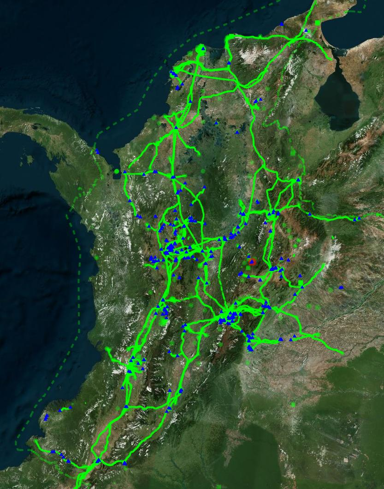
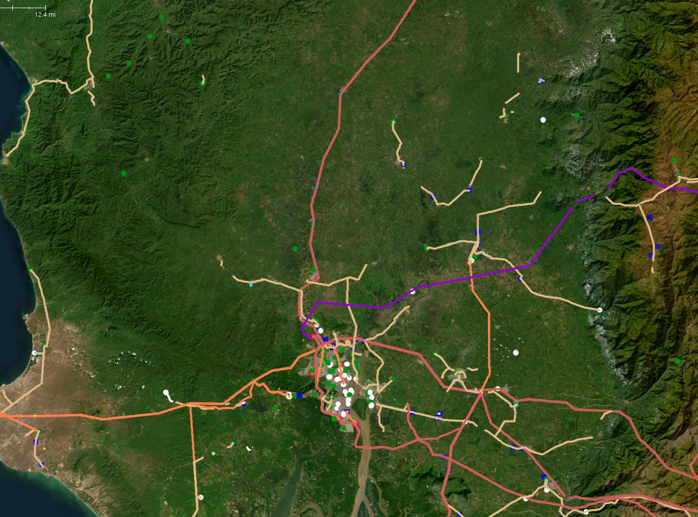
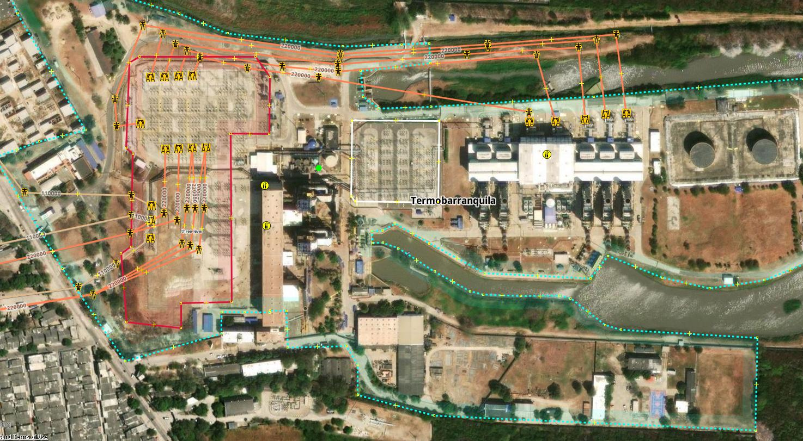
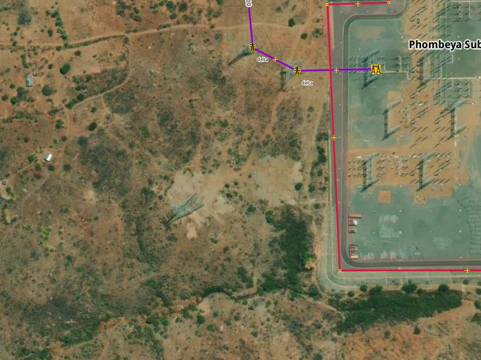
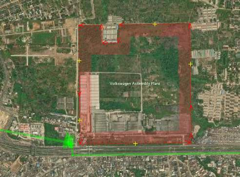
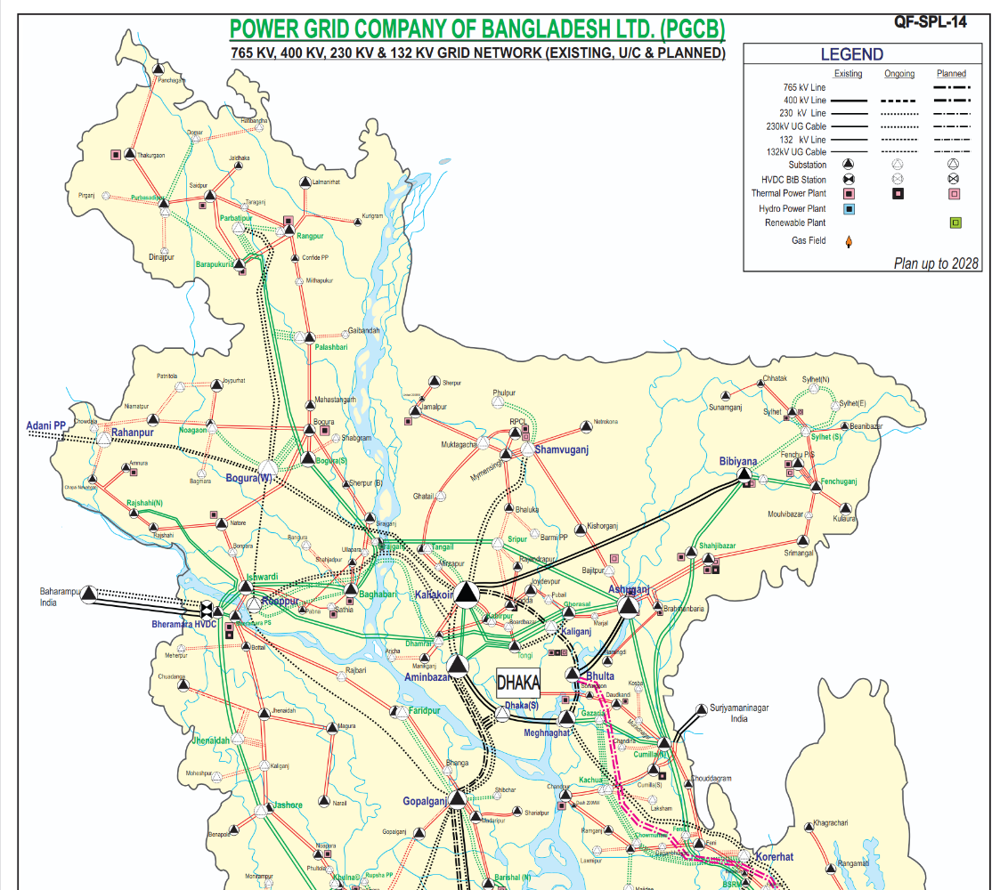
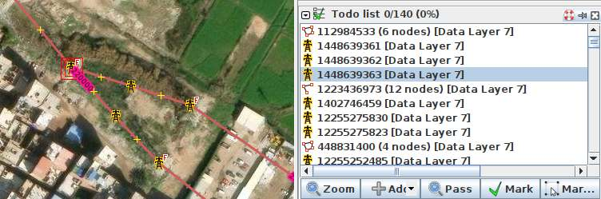
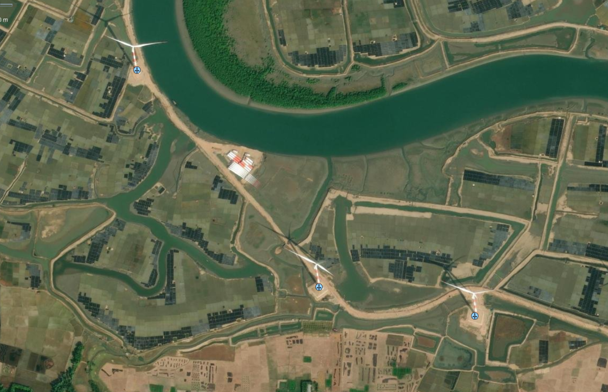
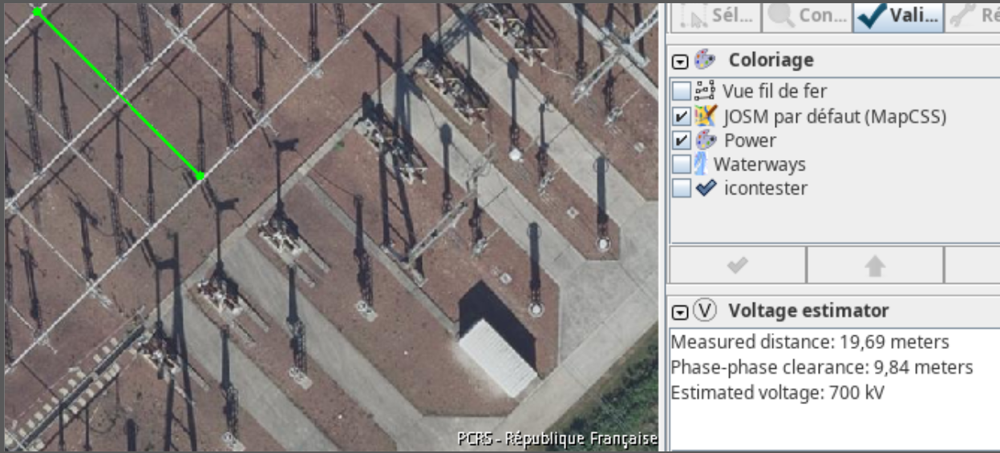

<h1>Tools and Strategies</h1>

Using the right tools and strategies is fundamental to mapping the electrical grid efficiently and accurately. The following strategies and tools will help you to extend existing transmission grid networks on OpenStreetMap. As a rule of thumb: The larger the towers and substations, the higher the voltage and the greater their relevance to the transmission grid. Priority should therefore be given to large, high-voltage infrastructure first. Please consider the following strategies and the associated processes as recommendations only. Ultimately, the most efficient strategy is the one that enables you to work on the electrical grid with passion and motivation over a longer period of time. The strategies can be divided roughly into two phases:

1. **Pioneer Mapping Strategies**: To ensure the power grid has the best possible coverage, we recommend beginning with Pioneer Mapping in each country. Several strategies are employed at this stage to identify the location of all lines, power poles, and substations. Rather than reducing issues in the grid, the main focus is on increasing coverage and extending the geographic information of the grid. This may result in an increased total number of issues in the grid. These strategies focus primarily on mapping the geographical location of power lines, towers, plants and substations, rather than technical grid details. They require good eyesight, fast mapping skills and an understanding of situations in which satellite data is insufficient for consistent grid mapping.

2. **Technical Mapping Strategies**: This phase involves solving more complex grid issues that require a fundamental understanding of the electrical grid. This includes mapping voltages, the number of circuits and routing issues. During this phase, the initial mapping work is validated against multiple sources to ensure its plausibility. These sources could include official maps from grid operators, statistics about grid length, and other official data. The main focus of these strategies is to minimise the number of complex quality issues in the grid.

## 
Pioneer Mapping Strategies
</h3>

### 
Continue Open Lines

    
    <figcaption class="image-caption">Osmose will provide you with a GeoJSON file containing the unfinished transmission power lines (shown as blue triangles) in the specified country, in this case Colombia. </figcaption>

_Continue Open Lines_ is the most efficent and most beginner friendly Strategy. It is directly integrated in [Map It📍](https://ohmygrid.org/map-it/). The strategy mainly depends on [osmose](https://osmose.openstreetmap.fr/en/map/), a quality assurance tool that detects issues in OpenStreetMap data on a daily basis. These include different power classes of issues, such as "unfinished power transmission lines" : 

1. Select `Unfinished power transmission line (Class 2) (recommended for beginners ⭐)__` from the drop-down menu, then click on the country or state you wish to map. 
2. Now drag and drop the GeoJSON file you have just downloaded into you JSOM window.
3. Press `CTRL+A` to select all the location you have selected and press `Add` in the window of the todo list plugin.
4. Click on `Default Transmission (90 kV+)` in the `Transmission Overpass Query` selected and download the tranmission grid data into another layer in JOSM. Activate this layer.
4. You can now step through all issues by pressing `Mark`.

### 
Spot the gaps in the grid

      
      <figcaption class="image-caption">Outdated satellite data results in larger gaps in the grid across many regions of Ecuador. These gaps can be spotted by lines that end abruptly rather than in a round circle, indicating a substation..</figcaption>

_Spot the gaps in the grid_ is a rather simple stradegy but highly efficent. By using a bolt map coloring that highlights gaps in the grid and unconnected substation, is it easy to spot where are gaps in the grid. Unlike the 'Continue Open Lines' strategy, this approach is more flexible and relies on human judgement to address obvious topological issues in the grid. This allows us to prioritise lines extending or connecting new regions of the grid — lines with topological relevance, in other words. 

As most transmission lines end at substations, the map painting technique allows us to mark the quiet lines that do not end at a substation with a circle. Zooming out allows the mapper to familiarise themselves with the gaps and nationwide coverage of the grid. If you haven't yet added our mapCSS to color the grid, you can find the recommended low-density grids map painting for this stradegy here <a href="https://raw.githubusercontent.com/open-energy-transition/color-my-grid/refs/heads/main/ohmygrid-default.mapcss">here.</a>

### 
Connect Power Plants 
</h3>
As most large power plants are directly connected to the transmission grid, Connect Power Plants provides an easy strategy using the comprehensive power plants dataset from Global Energy Monitor. A simple user interface for retrieving this data at a national level is integrated into [Map It📍](https://ohmygrid.org/map-it/), enabling users to preview and download GeoJSON data:

    
  <figcaption class="image-caption">A power plant in Colombia is located close to a large substation.</figcaption>

1. Select 'Global Energy Monitor – Power Plants' as the hint layer and press the country you like to map.
3. Drag and drop the GeoJSON file you have just downloaded into your JSOM window.
4. Press `CTRL+A` to select all locations and click Add in the Todo List plugin window.
5. Click on `Default Transmission (90 kV+)` in the `Transmission Overpass Query` selected and download the tranmission grid data into another layer in JOSM. Activate this layer.
6. You can now step through all the issues by pressing 'Mark'.
7. If you find a power plant that is missing in OpenStreetMap, please map it too.

### 
Connect Substations 
</h3>

  
  <figcaption class="image-caption">A substation in Malawi with an unmapped interconnector with the first tower in image center.</figcaption>

A simple yet efficient strategy for mapping the transmission grid is to check every substation for new lines branching out from it. 
As most national transmission grids are entirely connected, this strategy enables you to trace and therefore map the entire grid network. 
One single unmapped power tower can sometimes trace to a missing interconnector to another country as shown in the image of a substation in Malawi.
Can you see the power tower that's missing from the bottom Left corner?

1. Download the transmission grid data of your country using the [Map It📍](https://ohmygrid.org/map-it/) page.
2. Press CTRL+F and filter by `power=substation`.
3. With the installed todo plugin window press `Add`. 
4. Switch back to your transmission grid layer.
4. You can now step through all substations by pressing `Mark`.

### 
Connect Industrial Areas 
</h3>

  
  <figcaption class="image-caption">A substation in Malawi with an unmapped interconnector with the first tower in image center.</figcaption>

Large industrial facilities require huge amounts of energy and therefore have their own substations, and are sometimes even directly connected to the transmission grid. Stepping through all industrial areas can also reveal substations or power plants that are often tagged already as landuse=industrial. Try also to check the surrounding area too as substations are sometimes placed outside of the mapped industrial area. 

1. Download the transmission grid data of your country using the [Map It📍](https://ohmygrid.org/map-it/) page.
1. Download the industrial areas of your country using into a new layer using the [Map It📍](https://ohmygrid.org/map-it/) page.
1. Press CTRL+F and filter by `type:way landuse=industrial`.
1. With the installed todo plugin window press `Add`. 
1. Switch back to your transmission grid layer.
1. You can now step trouth all substations by pressing `Mark`.

### 
 Connect WikiData
</h3>

    
    <figcaption class="image-caption">Wikipedia articles about power infrastructure, such as the Gitanga hydroelectric power station in Kenya, also provide location data that can be systematically accessed via WikiData.</figcaption>   

WikiData provides access to Wikipedia articles about power infrastructure around the world. The [Map It📍](https://ohmygrid.org/map-it/) page provides you a simple interface to extract this data for the country you would like to map. The [osm-wikidata-comparison](https://github.com/open-energy-transition/osm-wikidata-comparison/) repository provides this data by identify missing or incomplete power infrastructure in OpenStreetMap by extracting structured data via the Wikidata API. It generates ready-to-use GeoJSON that can be opened in JOSM as a visual hint layer to guide new mapping work or improve existing tags.

1. Use the [Map It📍](https://ohmygrid.org/map-it/) page to download the transmission grid data for your country.
2. Download your country's WikiData into a new layer using the [Map It📍](https://ohmygrid.org/map-it/) page.
3. Press CTRL+A and click 'Add' in the 'Todo' window.
4. Switch back to your transmission grid layer.
3. You can now step through all WikiData entries by pressing 'Mark'.
3. If you spot any power plants or industrial areas missing from the map, please also include these in your mapping.

## 
Technical Mapping Strategies
</h2>

### 
Offical Data and Maps
</h3>

In order to map more effectively, it is recommended to use maps and datasets that can help you find missing power lines, substations and power plants. Most National transmission system operators provide publicly available maps, which can help you to estimate the coverage of the grid, and locate what is missing in OSM. Furthermore, having the names of substations can also help locate them. 
    

    
    <figcaption class="image-caption">Offical transmission grid map of Power Grid Bangladesh PLC.</figcaption>

OhMyGrid provides a list of [Curated Grid Maps](https://github.com/open-energy-transition/Awesome-Electric-Grid-Mapping), which contains datasets, maps, and documents for electrical grid all around the world.
⚠️ Please use these datasets as hint layers, and check licenses to see how/if you are allowed to use them. Do not copy/data from these maps directly into OpenStreetMap. Each data point of the transmission network must be set manually and <a href="https://wiki.openstreetmap.org/wiki/Verifiability">verified</a> with official satellite data provided by the OpenStreetMap community.

### 
 Searching and solving fixme tags
</h3>
OpenStreetMap allows mappers to quickly mark an object that seems to be wrong and needs fixing using the [Key:fixme](https://wiki.openstreetmap.org/wiki/Key:fixme) tag. For example, you can write `fixme=wrong voltage` if you think the voltage on a line is incorrect, but you don't know the correct value. A small F will then be visible on the edge of the symbol to indicate the fixme tag. Stepping through all the `fixme` tags in a country is also a great way to search for errors in the grid that you can try to fix. We recommend using the `todo list` plugin for this.

    
  <figcaption class="image-caption">Fixme tags loaded in the todo list.</figcaption>

1. Download the grid you want to look into using at the [Map It📍](https://ohmygrid.org/map-it/) page.
2. Press `CTRL+F`and search for `fixme=*`.
3. In the todo list window press `Add`.
4. After you fixed and issues please remove the fixme tag.

#### OpenData Plugin
The OpenData plugin will allow you to load all kinds of GIS formats directly into JOSM.

1. Download the `OpenData` plugin for JOSM. Go to Edit > Preferences. Search for `OpenData`, select it and press OK.
1. You should now be able to import much more data formats like (csv, xls, ods, kml, kmz, shp, mif) as another hint layer into JOSM.

### 
Open Infrastructure Map - Nighttime Lights and Osmose 
</h3>

    
    <figcaption class="image-caption">Open Infrastructure Map also includes the osmose issus in the grid as another layer.</figcaption>

1. Open Infrastructure Map can be used as a tool to map and find issues by utilising the nighttime lights feature.
2. Go to the <a href="https://openinframap.org/#2/26/12">website</a> and set the background to nighttime lights. This can help see clear "holes" in a country's grid.
3. In layers, activate the power validation feature. If you zoom in and find an unfinished power line, you can see the osmose issue affiliated to this line.

### 
Online Investigation :mag:

Searching for recent news articles, reports, academic studies or datasets related to newly operational substations and transmission lines is an effective way to find information about large-scale infrastructure projects that have just started construction or operation. As these facilities are of national interest, they are usually reported on in local news portals or on the websites of transmission grid operators. This is why there is so much news, articles and reports about new, large-scale substations, transmission lines and power plants starting operation.

    
    <figcaption class="image-caption">A wind farm in Bangladesh displayed in OpenStreetMap that has been discovered by offical documents.</figcaption>

Local Large Language Models (LLMs) can help by conducting searches in the country’s official language. For example: “Please search for news articles, reports, academic studies, or datasets about transmission lines or substations opened in Country A in the last 5 years. Use the official language of the country A. Only include resources not already listed in the <a href='https://github.com/open-energy-transition/Awesome-Electric-Grid-Mapping'>Awesome Electric Grid Mapping</a> repository.”

Please be aware of the licence and quality of the documents you are finding. If you cannot validate the information you find by different sources, you can at least use the names of substations, regions and towns to identify the locations of new substations or transmission lines, and verify their visibility in satellite images. The fastest way to search global power infrastructure like power plants, substations or country interconnector by name is by the search function of <a href="https://openinframap.org/#2/26/12">Open Infrastructure Map</a>.

### 
JOSM PowerNetworkTools Plugin 🔌
</h3>

This tool estimates the voltage of a substation busbar from aerial imagery by measuring the clearance between conductors. The clearance is dictated by the voltage and so allows an estimate of the voltage to be made. Although not a perfect method, when combined with knowledge of a country's standard power grid voltages and power infrastructure layout this can greatly assist mappers in assigning voltages to power infrastructure from aerial imagery.

    
    <figcaption class="image-caption">The OpenStreetMap Editor plugin that allows to roughly estimate the voltage levels based on phase to phase clearance measurements.</figcaption>   

1. Download the `PowerNetworkTools` plugin for JSOM. Go to Edit > Preferences. Search for `PowerNetworkTools`, select it and press OK. 
1. Activate the Volage Estimator in the `Windows` menu.
1. Press V to measure the distance between the two phases at the busbar.
1. Read more about how to use the plugin in the README of the [official repository](https://github.com/openinframap/josm-power-network-tools).

### 
Validating and Mapping Interconnectors 📥
</h3>
Interconnectors between countries are essential to the functioning of the transmission grid. Therefore, these lines should be regularly validated and carefully extended. If you are mapping an interconnector between two countries and want to see what’s mapped on the “other” side of the border, you can either do a quick Download from OSM in a new layer or use the following Overpass query:

    
    <figcaption class="image-caption">Overpass Query Example</figcaption>

1. Copy this <a href="https://raw.githubusercontent.com/open-energy-transition/osm-grid-definition/refs/heads/main/Other_queries/Border_overpass">query</a> and paste it into “Download from Overpass API” in JOSM.
2. Draw a small bounding box in the slippy map, then run the query to download.
3. 
<strong>Explanation:</strong> The query finds nodes in your bounding box, detects their admin area (level 4 by default), and fetches all power infrastructure within it. You can adjust the “admin level” in the query (e.g. level 2 for national, level 6 for province) by editing the <code>admin_level</code> parameter in the download tab. A smaller bounding box is better (faster execution).

