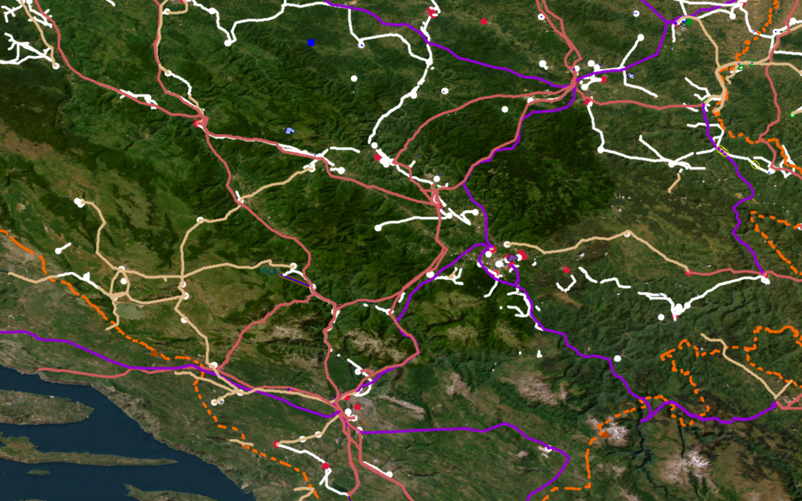

<h1>Tools and Strategies</h1>

The following strategies and tools will help you to extend the existing transmission grid networks in OpenStreetMap. In general, the larger the tower and substation, the higher the voltage and therefore the greater the importance to the network. Priority should therefore be given to large, high-voltage infrastructure first. 
The easiest way to start mapping the transmission network is to find the location of missing towers with the help of osmose. The Strategies can routhly been devided into two phases. You can apply these strategies in any order: 

1. `Pioneer Mapping Strategies`: To ensure the most efficient mapping of the power grid and the highest quality of data, we recommend starting with Pioneer Mapping in a country. Several strategies are used in this phase to capture the location of all lines, power poles and substations. Detailed tags such as voltages do not need to be set at this stage. This mapping phase is much easier for beginners and does not require detailed knowledge of the electrical grid.

2. `Technical Mapping Strategies`: This phase involves solving more complex grid issues that require a fundamental understanding of the electrical grid. This includes mapping voltages, the number of circuits and routing issues. During this phase, the initial mapping work is validated against multiple sources to ensure its plausibility. These sources could include official maps from grid operators, statistics about grid length, and other official data.

## 
Pioneer Mapping Strategies
</h3>

### 
Osmose per country
</h3>

    
    <figcaption class="image-caption">Osmose will provide you with a GeoJSON file containing the power issues you selected for the country you specified. In this case, it is Namibia. </figcaption>

This tool is integrated in [Map It📍](https://ohmygrid.org/map-it/), but can also be found at <a href="https://open-energy-transition.github.io/osmose_per_country/">this</a> front end interface. The tool allows fetching data on gaps in the OSM data through the OSMOSE API on a country level.

#### What is Osmose?
<a href="https://osmose.openstreetmap.fr/en/map/">Osmose-QA</a> is a quality assurance tool that detects issues in OpenStreetMap data. These include different classes of issues, such as "unfinished power transmission lines".

#### How to use the Osmose per country tool</h3>
1. Click on the Osmose issues button in [Map It📍](https://ohmygrid.org/map-it/) or go to the tool interface <a href="https://open-energy-transition.github.io/osmose_per_country/">website</a>.
2. In [Map It📍](https://ohmygrid.org/map-it/), you can simply choose the issue you want to look at, and then click on a country/region. This will download a geojson file for you which you can open in JOSM and use as a hint layer
Tip: On the tool website, certain countries have different names associated, so to fetch the data for the entire country use an asterisk (wildcard) like: <code>France*</code>

### 
Using the mapcss to locate "holes" in the grid 

      
      <figcaption class="image-caption">Mapcss layer of the Bosnian transmission grid in JOSM.</figcaption>

1. Another fast and efficient way to locate transmission lines that are unfinished, is to simply use the mapcss and look for unfinished lines. A lack of lines in a large area, could also tell you that a line might be missing there. 
2. If you haven't yet added our mapcss to JOSM, you can find it <a href="https://github.com/open-energy-transition/grid-mapping-starter-kit/tree/main/josm-config">here.</a>

### 
 Global Energy Monitor 
</h3>
[GEM per Country Power Tracker web application](https://github.com/open-energy-transition/gem_per_country) - This tool is integrated in Map It📍, and it allows users to preview and download GeoJSON data for global power plants in the [Global Energy Monitor](https://globalenergymonitor.org) database filtered by country and power plant status.

    
  <figcaption class="image-caption">Global Energy Monitor power plants(red) in relation to the grid data(green) for Angola</figcaption>

#### How to use the GEM power plants per country tool
1. Click on the Global Energy Monitor Power Plant button in [Map It📍](https://ohmygrid.org/map-it/) or go to the <a href="https://open-energy-transition.github.io/gem_per_country/">website</a>.
1. In [Map It📍](https://ohmygrid.org/map-it/), you can simply choose the issue you want to look at, and then click on a country/region. This will download a geojson file for you.
1. On the website, type the name of the country you want data for. Press preview, and download the geojson file.
1. You can open this geojson file in JOSM, where you will be able to see all power plants from the GEM database.

#### How to use the GEM power plants per country tool
1. Click on the Global Energy Monitor Power Plant button in [Map It📍](https://ohmygrid.org/map-it/).
1. In Map It📍, you can simply choose the issue you want to look at, and then click on a country/region. This will download a geojson file for you.
1. On the website, type the name of the country you want data for. Press preview, and download the geojson file.
1. You can open this geojson file in JOSM, where you will be able to see all power plants from the GEM database.

### 
Find new lines that branch off from substations 
</h3>

  
  <figcaption class="image-caption">A substation in Malawi with an unmapped interconnector with the first tower in image center.</figcaption>

A simple yet efficient strategy for mapping the transmission grid is to check every substation for new lines branching out from it. 
As most national transmission grids are entirely connected, this strategy enables you to trace and therefore map the entire grid network. 
One single unmapped power tower can sometimes trace to a missing interconnector to another country as shown in the image of a substation in Malawi.
Can you see the power tower that's missing from the bottom Left corner?

1. Download the transmission grid data of your country using the [Map It📍](https://ohmygrid.org/map-it/) page.
2. Press CTRL+F and filter by `power=substation`.
3. With the installed todo plugin window press `Add`. 
4. Switch back to your transmission grid layer.
4. You can now step through all substations by pressing `Mark`.

### 
Search industrial areas for connections to the transmission grid 
</h3>

  
  <figcaption class="image-caption">A substation in Malawi with an unmapped interconnector with the first tower in image center.</figcaption>

Large industrial facilities require huge amounts of energy and therefore have their own substations, and are sometimes even directly connected to the transmission grid. Stepping through all industrial areas can also reveal substations or power plants that are often tagged already as landuse=industrial. Try also to check the surrounding area too as substations are sometimes placed outside of the mapped industrial area. 

1. Download the transmission grid data of your country using the [Map It📍](https://ohmygrid.org/map-it/) page.
1. Download the industrial areas of your country using into a new layer using the [Map It📍](https://ohmygrid.org/map-it/) page.
1. Press CTRL+F and filter by `type:way landuse=industrial`.
1. With the installed todo plugin window press `Add`. 
1. Switch back to your transmission grid layer.
1. You can now step trouth all substations by pressing `Mark`.

### 
 Searching and using fixme tags
</h3>
OpenStreetMap allows mappers to quickly mark an object that seems to be wrong and needs fixing using the [Key:fixme](https://wiki.openstreetmap.org/wiki/Key:fixme) tag. For example, you can write `fixme=wrong voltage` if you think the voltage on a line is incorrect, but you don't know the correct value. A small F will then be visible on the edge of the symbol to indicate the fixme tag. Stepping through all the `fixme` tags in a country is also a great way to search for errors in the grid that you can try to fix. We recommend using the `todo list` plugin for this.

    
  <figcaption class="image-caption">Fixme tags loaded in the todo list.</figcaption>

1. Download the grid you want to look into using at the [Map It📍](https://ohmygrid.org/map-it/) page.
2. Press `CTRL+F`and search for `fixme=*`.
3. In the todo list window press `Add`.
4. After you fixed and issues please remove the fixme tag.

### 
 Wikidata/Wikipedia Hint Layer Tool
</h3>

    
    <figcaption class="image-caption">Wikidata Comparison GeoJSON Output(red) in comparision to grid data(green).</figcaption>   

The [tool] (https://github.com/open-energy-transition/osm-wikidata-comparison/) extracts structured power infrastructure data from Wikidata and exports it as GeoJSON and CSV files, organized by country and by QID (e.g., substations, power plants, battery storage systems).

You can use these GeoJSON files directly in JOSM as a visual hint layer to:

<ul>
  <li>Map new infrastructure not yet in OpenStreetMap (OSM).</li>
  <li>Improve metadata (tags, names, technologies, resource, Qid tag, etc.) of existing features.</li>
</ul>

The tool supports:

<ul>
  <li>Full extraction of all power-related infrastructure types in Wikidata.</li>
  <li>Targeted queries by specific QIDs (e.g., only substations, hydro plants, or storage systems).</li>
</ul>

Output includes:

<ul>
  <li>A folder per QID with all infrastructure found, including per-country .geojson files and CSVs with/without coordinates.</li>
  <li>A combined <code>wikidata_all_qids_with_coordinates.csv</code> with all QIDs merged.</li>
  <li>A <code>geojson_by_country/</code> folder containing per-country files aggregating all relevant QID types.</li>
</ul>

## 
Technical Mapping Strategies
</h2>

### 
Data and maps as hint layers
</h3>

In order to map more effectively, it is recommended to try and find maps and datasets that can help you find power lines, substations and power plants. National transmission system operators sometimes have publicly available maps, which can help you visualise the current state of the grid, and locate what is missing in OSM. Furthermore, having the names of substations can also help locate them. 
    

    
    <figcaption class="image-caption">Offical transmission grid map of Power Grid Bangladesh PLC.</figcaption>

We have made list of [Curated Grid Maps](https://ohmygrid.org/awesome/) which you can access on this website too, which has datasets, maps, and information for many countries around the world.
⚠️ Please use these datasets as hint layers, and check licenses to see how/if you are allowed to use them. Do not copy/data from these maps directly into OpenStreetMap. Each data point of the transmission network must be set manually and <a href="https://wiki.openstreetmap.org/wiki/Verifiability">verified</a> with official satellite data provided by the OpenStreetMap community.⚠️

#### OpenData Plugin
The OpenData plugin will allow you to load all kinds of GIS formats directly into JOSM.

1. Download the `OpenData` plugin for JSOM. Go to Edit > Preferences. Search for `OpenData`, select it and press OK.
1. You should now be able to import much more data formats like (csv, xls, ods, kml, kmz, shp, mif) as another hint layer into JOSM.

### 
Open Infrastructure Map - Nighttime Lights and Osmose 
</h3>

    
    <figcaption class="image-caption">Open Infrastructure Map also includes the osmose issus in the grid as another layer.</figcaption>

1. Open Infrastructure Map can be used as a tool to map and find issues by utilising the nighttime lights feature.
2. Go to the <a href="https://openinframap.org/#2/26/12">website</a> and set the background to nighttime lights. This can help see clear "holes" in a country's grid.
3. In layers, activate the power validation feature. If you zoom in and find an unfinished power line, you can see the osmose issue affiliated to this line.

### 
Online investigation :mag:

Searching for recent news articles, reports, academic studies or datasets related to newly operational substations and transmission lines is an effective way to find information about large-scale infrastructure projects that have just started construction or operation. As these facilities are of national interest, they are usually reported on in local news portals or on the websites of transmission grid operators. This is why there is so much news, articles and reports about new, large-scale substations, transmission lines and power plants starting operation.

    
    <figcaption class="image-caption">A wind farm in Bangladesh displayed in OpenStreetMap that has been discovered by offical documents.</figcaption>

Local Large Language Models (LLMs) can help by conducting searches in the country’s official language. For example: “Please search for news articles, reports, academic studies, or datasets about transmission lines or substations opened in Country A in the last 5 years. Use the official language of the country A. Only include resources not already listed in the <a href='https://github.com/open-energy-transition/Awesome-Electric-Grid-Mapping'>Awesome Electric Grid Mapping</a> repository.”

Please be aware of the licence and quality of the documents you are finding. If you cannot validate the information you find by different sources, you can at least use the names of substations, regions and towns to identify the locations of new substations or transmission lines, and verify their visibility in satellite images. The fastest way to search global power infrastructure like power plants, substations or country interconnector by name is by the search function of <a href="https://openinframap.org/#2/26/12">Open Infrastructure Map</a>.

### 
JOSM PowerNetworkTools Plugin 🔌
</h3>

This tool estimates the voltage of a substation busbar from aerial imagery by measuring the clearance between conductors. The clearance is dictated by the voltage and so allows an estimate of the voltage to be made. Although not a perfect method, when combined with knowledge of a country's standard power grid voltages and power infrastructure layout this can greatly assist mappers in assigning voltages to power infrastructure from aerial imagery.

    
    <figcaption class="image-caption">The OpenStreetMap Editor plugin that allows to roughly estimate the voltage levels based on phase to phase clearance measurements.</figcaption>   

1. Download the `PowerNetworkTools` plugin for JSOM. Go to Edit > Preferences. Search for `PowerNetworkTools`, select it and press OK. 
1. Activate the Volage Estimator in the `Windows` menu.
1. Press V to measure the distance between the two phases at the busbar.
1. Read more about how to use the plugin in the README of the [official repository](https://github.com/openinframap/josm-power-network-tools).

### 
Downloading transmission data of an area near a border 📥
</h3>

If you are mapping an interconnector between two countries and want to see what’s mapped on the “other” side of the border, you can either do a quick Download from OSM in a new layer or use the following Overpass query:

    
    <figcaption class="image-caption">Overpass Query Example</figcaption>

1. Copy this <a href="https://raw.githubusercontent.com/open-energy-transition/osm-grid-definition/refs/heads/main/Other_queries/Border_overpass">query</a> and paste it into “Download from Overpass API” in JOSM.
2. Draw a small bounding box in the slippy map, then run the query to download.
3. 
<strong>Explanation:</strong> The query finds nodes in your bounding box, detects their admin area (level 4 by default), and fetches all power infrastructure within it. You can adjust the “admin level” in the query (e.g. level 2 for national, level 6 for province) by editing the <code>admin_level</code> parameter in the download tab. A smaller bounding box is better (faster execution).

### 
 Google Maps substations 🚫 
</h2>
Google Maps would be the perfect additional data source for the locations and names of substations worldwide, but so far <strong>no official authorisation has been granted</strong> for using the location of substation within OpenStreetMap. Google Maps shows many transmission and distribution substations that are difficult to locate using current mapping strategies, particularly in remote areas of low- and middle-income countries.

    
    <figcaption class="image-caption"> An Angola distribution substation missing in OpenStreetMap. Imagery ©2025 CNES/Airbus, Maxar Technologies. Map data ©2025 </figcaption>

Knowing only the locations of these substations would greatly accelerate the progress of grid mapping and allow the discovery of smaller substations that are relevant for estimating distribution network coverage and rural electrification levels. Together with the OpenStreetMap community, the data can be integrated using officially authorised satellite images for OpenStreetMap contributors, <strong>if</strong> permission is granted!
Google Maps has <strong>not</strong> yet granted official authorisation for the use of its data. Google would provide a significant boost to the sustainable energy transition, tackling climate change and bringing electricity to rural communities at the same time. Therefore, we are kindly requesting formal permission to access and utilize the coordinates of ‘electrical substations’ displayed on Google Maps, for the purpose of enriching OpenStreetMap and advancing global grid mapping initiatives. 

