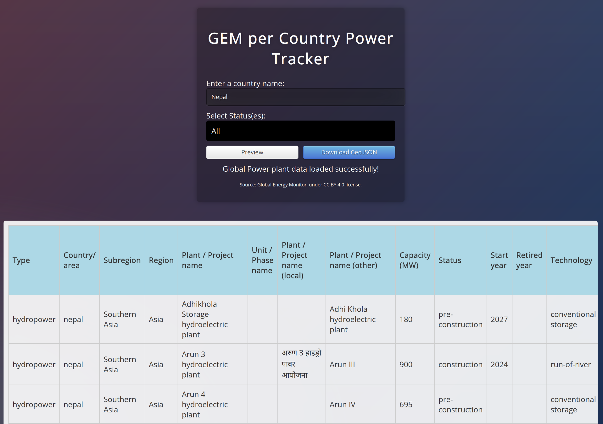

# **Useful Grid Mapping tools for OSM**


## **1. Osmose per country** 
[Osmose per country](https://github.com/open-energy-transition/osmose_per_country) - This is a front end interface that allows fetching data on gaps in the OSM data through the OSMOSE API on a country level.

### What is Osmose?
"[Osmose-QA](https://osmose.openstreetmap.fr/en/map/) is a quality assurance tool that detects issues in OpenStreetMap data"

### How to use the Osmose per country tool
1. Go to the tool [website](https://open-energy-transition.github.io/osmose_per_country/) or the repository to find it.
2. Type the name of the country you want to find osmose issues for.
3. Press Fetch Data. This will download a geojson file you can use as a hint layer in JOSM.

Tip: Certain countries have different names associated, so to fetch the data for the entire country use an asterisk (wildcard) like: France*
<br> 
<br>
<div class="align-with-heading">
  
</div>
## **2. OSM and Global Energy Monitor comparison tool**
[GEM per Country Power Tracker web application](https://github.com/open-energy-transition/gem_per_country) - The tool allows users to preview and download GeoJSON data for global power plants in the Global Energy Monitor database filtered by country and power plant status.

### How to use the GEM power plants per country tool
1. Go to the [repository](https://github.com/open-energy-transition/gem_per_country) and copy the line to clone (instructions can be found there)
2. In your terminal/command prompt: 
```
git clone https://github.com/open-energy-transition/gem_per_country.git
```

```
cd gem_per_country
```
```
open index.html   # macOS
xdg-open index.html   # Linux
start index.html   # Windows
```
You can also open the index.html file. <br><br>
3. Type the name of the country you want to data for. Press preview, and download the geojson file.

<div class="align-with-heading">
  
</div>
## **3. OSM and Wikidata comparison tool**
This [repository](https://github.com/open-energy-transition/osm-wikidata-comparison/tree/main) contains a Python script compares power plant data between OpenStreetMap (OSM) and Wikidata. It fetches data from both sources using APIs, performs comparisons based on geographic proximity and name, and identifies missing power plants or coordinate mismatches.<br> The comparison results are saved in CSV and GeoJSON formats.


### How to use the OSM-Wikidata comparison tool
1. Paste the [requirements.txt](https://github.com/open-energy-transition/osm-wikidata-comparison/blob/main/requirements.txt) file in your current directory/folder.
2. Install dependencies needed
```
pip install -r requirements.txt
```
3. Choose the country you want in the code by changing the name and Wikidata code. Run the script
```py
# ---------------------- CONFIGURATION ---------------------- #
# Specify the country you want to analyze. Adjust the 'COUNTRY_NAME' and 'country_code' accordingly.
COUNTRY_NAME = "Kenya" # Example: "Germany", "Brazil", "France"
#country_code = "Q1033"   # Country code according to Wikidata
max_distance_km = 0.7  #max_distance_km (float): The maximum distance to consider a match (in kilometers).
mismatch_threshold_km = 0.5 #mismatch_threshold_km (float): The threshold distance beyond which the coordinates are considered mismatched.
```


