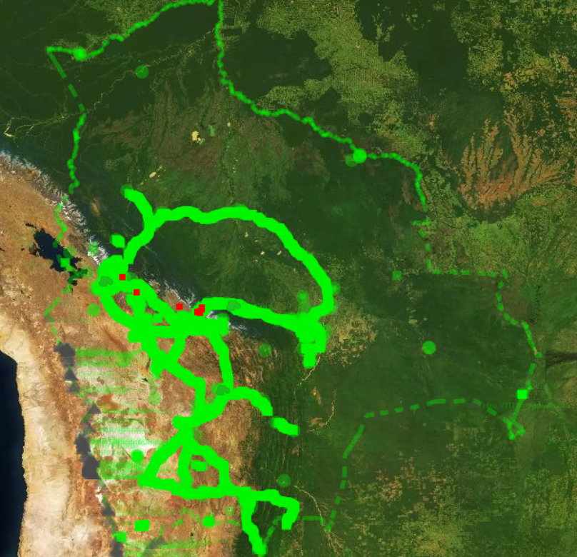
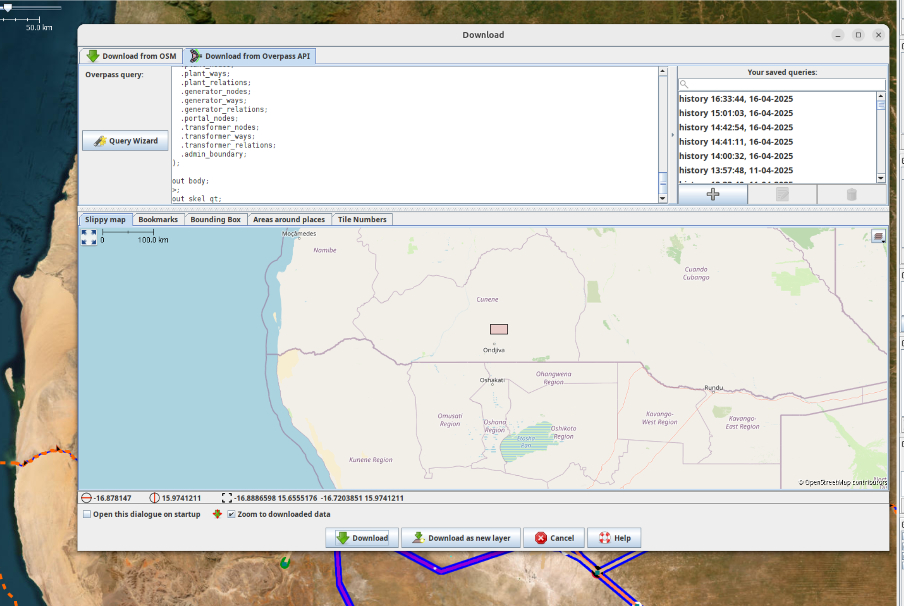

<h1>Useful Grid Mapping Tools for OSM </h1>

## 
Osmose per country
</h2>

  
 
    
<a href="https://open-energy-transition.github.io/osmose_per_country/">Osmose per country</a> - This is a front end interface that allows fetching data on gaps in the OSM data through the OSMOSE API on a country level.

    <h3>What is Osmose?</h3>
    
"<a href="https://osmose.openstreetmap.fr/en/map/">Osmose-QA</a> is a quality assurance tool that detects issues in OpenStreetMap data"

    <h3>How to use the Osmose per country tool</h3>
    <ol>
      <li>Go to the tool <a href="https://open-energy-transition.github.io/osmose_per_country/">website</a> or the repository to find it.</li>
      <li>Type the name of the country you want to find osmose issues for.</li>
      <li>Press Fetch Data. This will download a geojson file you can use as a hint layer in JOSM.</li>
    </ol>
    
Tip: Certain countries have different names associated, so to fetch the data for the entire country use an asterisk (wildcard) like: <code>France*</code>

  

  

    
    
  

## 
OSM and Global Energy Monitor comparison tool
</h2>

  

    
<a href="https://open-energy-transition.github.io/gem_per_country/">GEM per Country Power Tracker web application</a> - The tool allows users to preview and download GeoJSON data for global power plants in the <a href="https://globalenergymonitor.org/">Global Energy Monitor</a> database filtered by country and power plant status.

    <h3>How to use the GEM power plants per country tool</h3>
    <ol>
      <li>Go to the <a href="https://open-energy-transition.github.io/gem_per_country/">website</a>.</li>
      <li>Type the name of the country you want data for. Press preview, and download the geojson file.</li>
      <li>You can open this geojson file in JOSM, where you will be able to see all power plants from the GEM database.</li>
    </ol>
  

  

    
    
  

## 
Data and maps as hint layers
</h2>

  

    
 In order to map more effectively, it is recommended to try and find maps and datasets that can help you find power lines, substations and power plants. National transmission system operators sometimes have publicly available maps, which can help you visualise the current state of the grid, and locate what is missing in OSM. Furthermore, having the names of substations can also help locate them.   
    
    We have made an "[awesome list](https://ohmygrid.org/awesome/)" which you can access on this website too, which has datasets, maps, and information for many countries around the world.   
    
    ❗ Please use these datasets as hint layers, and check licenses to see how/if you are allowed to use them. Do not copy/data from these maps directly into OpenStreetMap. Each data point of the transmission network must be set manually and [verified](https://wiki.openstreetmap.org/wiki/Verifiability) with official satellite data provided by the OpenStreetMap community.

  

  

    
    
  

## 
OSM and Wikidata comparison tool

  

    

      This <a href="https://github.com/open-energy-transition/osm-wikidata-comparison/tree/main">repository</a>
      contains two Python scripts that compare power plant data between OpenStreetMap (OSM) and Wikidata, and also substation data.
      The power plant tool fetches data from both sources using APIs, performs comparisons based on geographic proximity
      and name, and identifies missing power plants or coordinate mismatches. The comparison results are saved in CSV
      and GeoJSON formats.
    

    <h3>How to use the OSM‑Wikidata powerplant comparison tool</h3>
    <ol>
      <li>Paste the <a href="https://github.com/open-energy-transition/osm-wikidata-comparison/blob/main/requirements.txt">requirements.txt</a> into your working directory.</li>
      <li>Install dependencies:
        <pre><code class="language-bash">pip install -r requirements.txt</code></pre>
      </li>
      <li>Configure and run the script:
        <pre><code class="language-python"># ---------------------- CONFIGURATION ---------------------- #
COUNTRY_NAME = "Kenya"        # e.g. "Germany", "Brazil"
country_code  = "Q1033"       # Wikidata country code
max_distance_km    = 0.7      # match radius in km
mismatch_threshold_km = 0.5   # coordinate‑mismatch threshold in km
        </code></pre>
      </li>
      <li>Open the resulting GeoJSON in JOSM to inspect and map powerplants.</li>
    </ol>

    <h3>How to use the OSM‑Wikidata substation comparison tool</h3>
    <ol>
      <li>Ensure the same <a href="https://github.com/open-energy-transition/osm-wikidata-comparison/blob/main/requirements.txt">requirements.txt</a> is in place.</li>
      <li>Install dependencies (if not already done):
        <pre><code class="language-bash">pip install -r requirements.txt</code></pre>
      </li>
      <li>Run the substation comparison script.
      </li>
      <li>Inside the output folder, open any country’s GeoJSON in JOSM to locate and verify substations.</li>
    </ol>
  

  

    
    
    
  

     

## 
Open Infrastructure Map 
</h2>

  

   Open Infrastructure Map can be used as a tool to map and find issues by utilising the nighttime lights feature and osmose issues. 
   <ol>
    <li> Go to the <a href="https://openinframap.org/#2/26/12">website</a> and set the background to nighttime lights. This can help see clear "holes" in a country's grid.</li> 
    <li> In layers, activate the power validation feature. If you zoom in and find an unfinished power line, you can see the osmose issue affiliated to this line.</li>
   </ol>
  
 
  

     
     
  

## 
Find new Lines that Branch off from Substations 
</h2>

  

   A simple yet efficient strategy for mapping the transmission grid is to check every substation for new lines branching out from it. 
   As most national transmission grids are entirely connected, this strategy enables you to trace and therefore map the entire grid network. 
   One single unmapped power tower can sometimes trace to a missing interconnector to another country as shown in the image of a substation in Malawi.
   Can you see the power tower that's missing from the bottom Left corner?
  
 
  

     
     <figcaption class="image-caption">A substation in Malawi with an unmapped interconnector in the left corner.</figcaption>
  

## 
Google Maps Substations 
</h2>

  

    
Google Maps would be the perfect additional data source for the locations and names of substations worldwide, but so far <strong>no official authorisation has been granted</strong> for using the location of substation within OpenStreetMap. Google Maps shows many transmission and distribution substations that are difficult to locate using current mapping strategies, particularly in remote areas of low- and middle-income countries.

    
Knowing only the locations of these substations would greatly accelerate the progress of grid mapping and allow the discovery of smaller substations that are relevant for estimating distribution network coverage and rural electrification levels. Together with the OpenStreetMap community, the data can be integrated using officially authorised satellite images for OpenStreetMap contributors, <strong>if</strong> permission is granted!

    
Google Maps has <strong>not</strong> yet granted official authorisation for the use of its data. Google would provide a significant boost to the sustainable energy transition, tackling climate change and bringing electricity to rural communities at the same time. Therefore, we are kindly requesting formal permission to access and utilize the coordinates of ‘electrical substations’ displayed on Google Maps, for the purpose of enriching OpenStreetMap and advancing global grid mapping initiatives. This task for request is currently in progress and can be found <a href="https://github.com/orgs/open-energy-transition/projects/25?pane=issue&itemId=102888888">here</a>.

  

  

    <figure>
      
      <figcaption class="image-caption"> An Angola distribution substation missing OpenStreetMap. Imagery ©2025 CNES/Airbus, Maxar Technologies. Map data ©2025 Google</figcaption>
    </figure>
  

## 
Mapping strategies 🔍

  

    
The following strategies outline different approaches to extending the existing transmission network. In general, the larger the tower and substation, the higher the voltage and therefore the greater the importance to the network. Priority should therefore be given to large, high-voltage infrastructure first. The easiest way to start mapping the transmission network is to find the location of new “towers.” You can hardly go wrong with this and it will help you to familiarise yourself with the tool and the local network. <strong>Only map infrastructure that you can confidently classify using satellite or ground imagery.</strong>

    <ul class="strategy-list">
      <li>Search for all “Unfinished power lines” in Osmose and check if you are able to find new towers at the end of the line. See the <a href="https://open-energy-transition.github.io/Oh-my-Grid/tools/">tools</a> section.</li>
      <li>Check if wind parks, solar farms, and power plants are connected to the transmission grid. The <a href="https://open-energy-transition.github.io/gem_per_country/">GEM per Country</a> tool helps you to create a GeoJSON file of all the power plants in a country.</li>
      <li>Ensure all transmission substations are connected to the grid.</li>
      <li>Check for news reports on new substations and transmission lines that have become operational in recent years. LLMs like ChatGPT allow you to search in the local language: “Please search for news about transmission lines or substations recently opened in Country A. Please use the official language of the country for your search.”</li>
      <li>Search for new substation records and national substation datasets as a reference “hint” layer. LLMs like ChatGPT allow you to search in the local language: “Please search for transmission lines or substation datasets in X. Please use the official language of the country for your search.” For a curated list of datasets that may be useful, see the Awesome Electric Grid Mapping List.</li>
    </ul>
  

  

    <!-- No images for this section -->
  

## 
Downloading transmission data of an area near a border 📥

  

    
If you are mapping an interconnector between two countries and want to see what’s mapped on the “other” side of the border, you can either do a quick Download from OSM in a new layer or use the following Overpass query:

    <ol>
      <li>Copy this <a href="https://github.com/open-energy-transition/grid-mapping-starter-kit/blob/main/scripts/Alternative_overpass.overpassql">query</a> and paste it into “Download from Overpass API” in JOSM.</li>
      <li>Draw a small bounding box in the slippy map, then run the query to download.</li>
    </ol>
    
<strong>Explanation:</strong> The query finds nodes in your bounding box, detects their admin area (level 4 by default), and fetches all power infrastructure within it. You can adjust the “admin level” in the query (e.g. level 2 for national, level 6 for province) by editing the <code>admin_level</code> parameter in the download tab. A smaller bounding box is better (faster execution).

  

  

    
  

## 
Bing attribution issue ⛔

  

    
At the moment, there seems to be an issue with Bing attribution in JOSM where it only loads in the mornings (CET). To work around this:

    <ol>
      <li>On a day when Bing attribution is working, copy the <code>bing.attribution.xml</code> file from your JOSM folder to a safe place:
        <ul>
          <li><strong>Windows:</strong> <code>%APPDATA%\JOSM\bing.attribution.xml</code></li>
          <li><strong>Linux:</strong> <code>~/.cache/JOSM/bing.attribution.xml</code></li>
        </ul>
      </li>
      <li>On a day when it isn’t working, replace the broken file with your saved copy, then restart or reload JOSM.</li>
    </ol>
  

  

    <figure>
      
    </figure>
  

